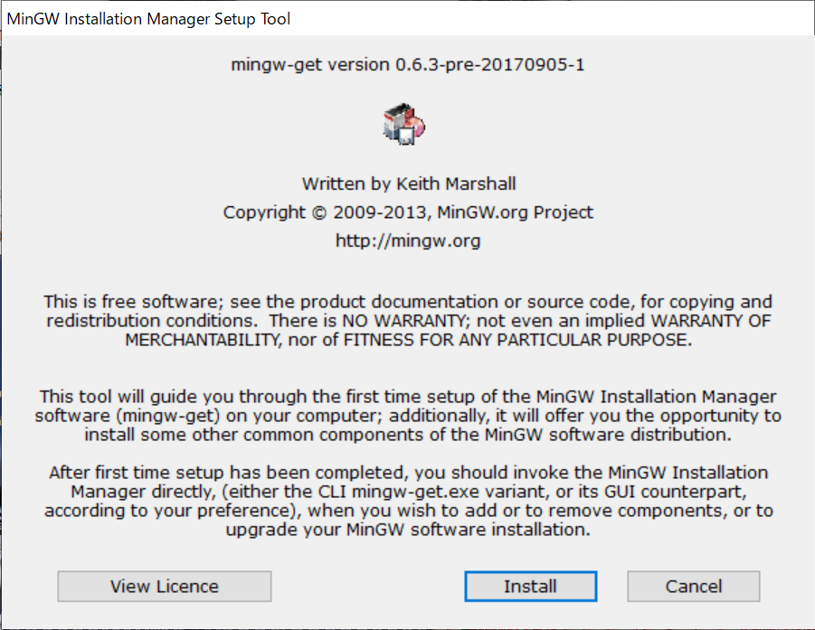
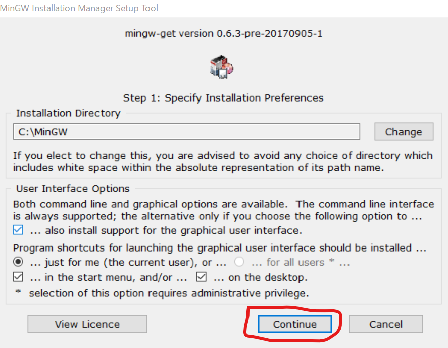
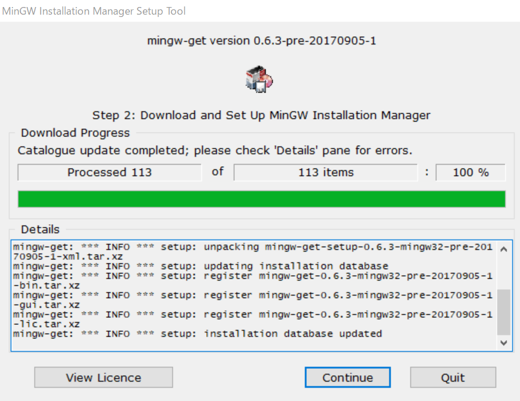
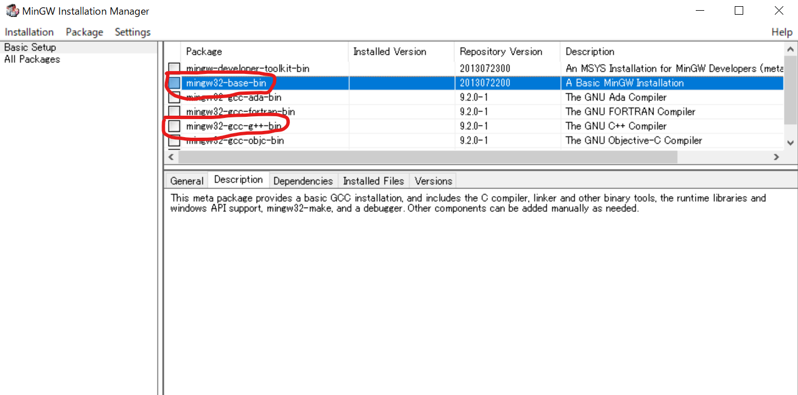
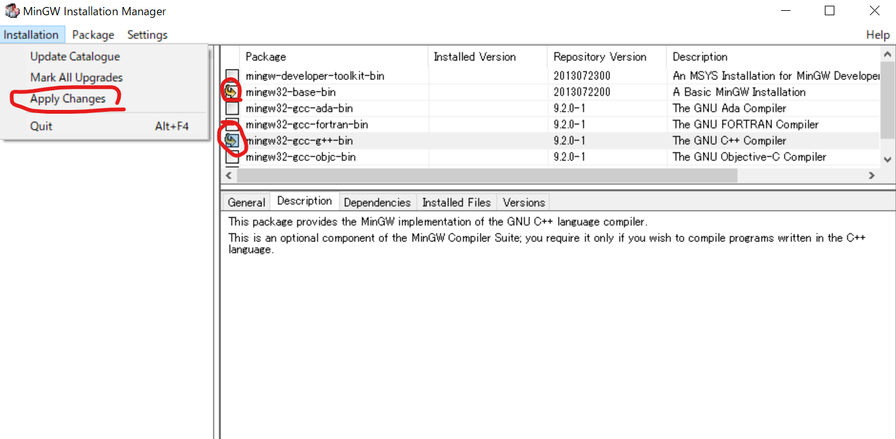

# Git Bashでg++を使えるようにする

## MinGWのインストール

まず、MingWをインストールする。以下のURLにアクセスせよ。

[https://osdn.net/projects/mingw/downloads/68260/mingw-get-setup.exe/](https://osdn.net/projects/mingw/downloads/68260/mingw-get-setup.exe/)

自動的に`mingw-get-setup.exe`というファイルがダウンロードされるはずなので、実行せよ。

以下のような画面となるので「Install」を実行。



次はそのまま「Continue」



するとインストールが始まる。



インストールが完了したら「Continue」すると、以下のパッケージ選択画面となる。



ここで

* mingw32-base-bin
* mingw32-gcc-g++-bin

の二つにチェックを入れる。チェックボックスをクリックするとメニューが出るので「Mark for Instllation」を選ぶこと。

二つにチェックが入った状態で、メニューの「Instllation」から「Apply Changes」をクリックする。



「Ok to proceed?」と聞かれたら「Apply」を選ぶと選んだインストールが始まる。終わったら「Close」して、MinGW Instllation Managerを終了してよい。

## Git Bashにパスを通す

先ほどインストールしたg++は、`C:\MINGW\bin`に入っている。これをGit Bashから読めるようにする。

まずGit Bashを起動して、`vim`で`.bashrc`を開き、以下の行を付け加える。

```sh
export PATH=C:\\MINGW\\bin:$PATH
```

ここで、バックスラッシュ「`\`」を二つ重ねる必要があることに注意。おそらく`.bashrc`はこんな感じになっているはず。

```sh
$ cat .bashrc
export DISPLAY=localhost:0.0
export PATH=C:\\MINGW\\bin:$PATH
eval `ssh-agent`
```

修正したら、Git Bashを再起動せよ。

コマンドプロンプトで`g++ --version`と入力してバージョンが表示されればインストール完了である。

```sh
$ g++ --version
g++.exe (MinGW.org GCC Build-20200227-1) 9.2.0
Copyright (C) 2019 Free Software Foundation, Inc.
This is free software; see the source for copying conditions.  There is NO
warranty; not even for MERCHANTABILITY or FITNESS FOR A PARTICULAR PURPOSE.
```
