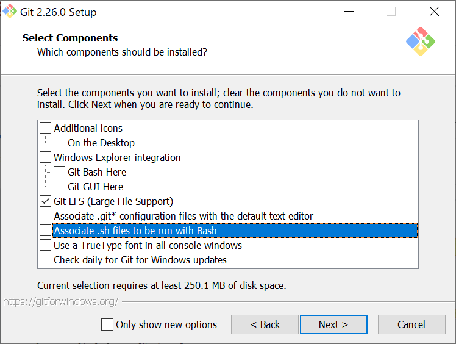
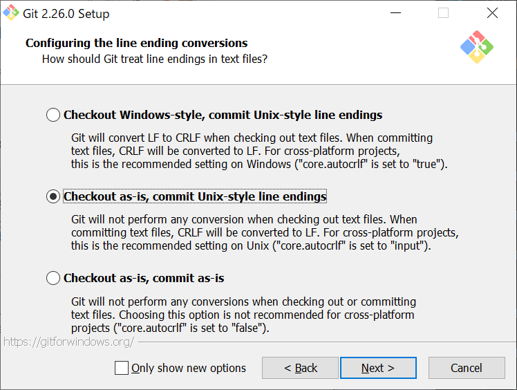
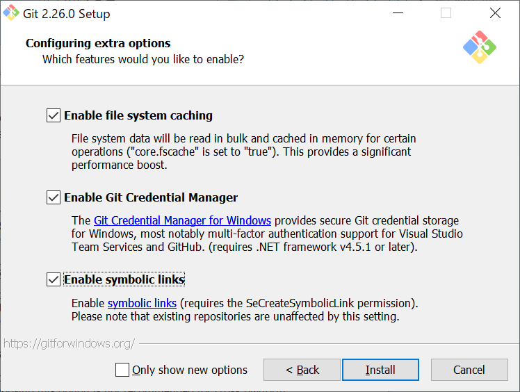

# 古い情報

WSLを使うことにしたため、以下は古い情報。

## Windows

Windowsの場合、[https://git-scm.com/](https://git-scm.com/)からWindows用のインストーラをダウンロード、インストールする。右の方に「Download 2.26.0 for Windows」というボタンがあるはずなのでクリック。

* Information: そのままNext
* Select Components: 「Git LFS」以外のチェックを外す。
* 
* Choosing the default editor used by Git: デフォルトの「Use Vim」のまま
* Adjusting your PATH environment: デフォルトの「Git from the command line and also from 3rd-party software」のまま
* Choosing the SSH executable: デフォルトの「Use OpenSSH」のまま
* Choosing HTTPS transport backend: デフォルトの「Use the OpenSSL library」のまま
* Configuring the line ending conversions: 「Checkout as-is, commit Unix-style line endings」を選ぶ
* 
* Configuring the terminal emulator to use with Git Bash: デフォルトのUse MinTTYのまま
* Configuring extra options: デフォルトでは「Enable symbolic links」が外れているが、これも含めて全てにチェックを入れる。
* 

あとはインストールを待つ。インストール終了後、Git Bashというものがインストールされているので実行し、

```sh
git --version
```

と入力して、

```txt
git version 2.26.0.windows.1
```

と表示されれば成功である。また、Windowsのコマンドプロンプトからも実行できることを確認しておこう。「コマンドプロンプト」を実行し、同様にgitのバージョンを確認せよ。実行できたらインストール完了である。