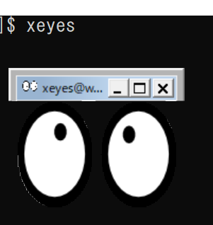

# gnuplotの使い方

これから、なんらかの数値計算を行うと、何かデータが出力される。それをグラフにしなければならない。エクセルを始めデータからグラフにするアプリケーションは多数あるが、ここではgnuplot(グニュプロット、グニュープロット)の使い方を覚えよう。

gnuplotは長い歴史を持つツールで、非常に多機能なので、その全ての機能を覚えるのは難しい。以下では必要最低限の使い方だけを覚え、後は必要に応じて機能を調べていくと良い。

## X Window Systemのインストール

そのうちローカルにインストールして利用するのが良いが、とりあえずは研究室サーバに接続して利用することにしよう。そのためにはX Window Systemのインストールが必要だ。

### Macの準備

まだインストールしていない場合は、XQuartzをインストールする。[https://www.xquartz.org/](https://www.xquartz.org/)から、`XQuartz-2.7.11.dmg`をダウンロードし、インストールする。

XQuartzは「アプリケーション」→「ユーティリティ」にインストールされるので起動する。「xterm」というウィンドウが開けばインストールできてる。

その後、XQuartzの「環境設定」の「セキュリティ」タブで、「接続を認証」と「ネットワーク・クライアントからの接続を許可」の両方にチェックを入れる(デフォルトで「接続を認証」にはチェックが入っているはず)。

さらに、ターミナルから

```sh
defaults write org.macosforge.xquartz.X11 enable_iglx -bool true
```

を実行しておく。以上の変更を適用するためにXQuartzを再起動すること。

その後、ターミナルを開けば準備完了である。

### Windowsの準備

[https://sourceforge.net/projects/vcxsrv/](https://sourceforge.net/projects/vcxsrv/)から、VcXsrvをインストールする。

インストール後に、XLaunchを起動する。Windows 10なら「ここに入力して検索」と表示されている検索窓にXLaunchと入力すれば起動する。

起動後にいろいろ聞かれるが、全てデフォルトのまま「次へ」を押して最後に「完了」を押せばよい。

その後、Git Bashを開いて、`.bashrc`ファイルを開く。

```sh
vim .bashrc
```

そして、以下の行を記入する(既にこのファイルがある場合は追加する)。

```sh
export DISPLAY=localhost:0.0
```

編集が終わったら以下で再読み込みをしよう。これは今回のみで、次回のGit Bashの起動からは不要だ。

```sh
source .bashrc
```

なお、次回Git Bashを起動時に

```txt
WARNING: Found ~/.bashrc but no ~/.bash_profile, ~/.bash_login or ~/.profile.

This looks like an incorrect setup.
A ~/.bash_profile that loads ~/.bashrc will be created for you.
```

といった警告が出るが、これは「.bashrcがあるのに.bash_profileが無かったから作っておいたよ」というメッセージで、次回起動からは表示されないので気にしなくて良い。

これで準備完了だ。

## 接続とX Window Systemの確認

研究室のサーバにsshで接続せよ。ただし、その際に `-AY`オプションをつけること。

```sh
ssh username@servername.hogehoge.ac.jp -AY
```

接続出来たら、X Window Systemが使えることを確認しよう(俗に「Xを飛ばす」と言う)。以下を実行せよ。

```sh
xeyes
```

以下のような、マウスを追いかける目玉が表示されたら成功だ。



## Gnuplotを使う

### 関数のプロット

まずはgnuplotを起動しよう。研究室サーバにログインし、`gnuplot`を実行せよ。

以下のような表示がされ、入力待ちとなる。

```sh
$ gnuplot

        G N U P L O T
        Version 4.6 patchlevel 2    last modified 2013-03-14
        Build System: Linux x86_64

        Copyright (C) 1986-1993, 1998, 2004, 2007-2013
        Thomas Williams, Colin Kelley and many others

        gnuplot home:     http://www.gnuplot.info
        faq, bugs, etc:   type "help FAQ"
        immediate help:   type "help"  (plot window: hit 'h')

Terminal type set to 'x11'
gnuplot>        
```

gnuplotは、様々な関数をプロットできる。例えばsin(x)を表示してみよう。

```sh
gnuplot> plot sin(x)
```

サインカーブが表示されたはずだ。何も指定しないと、x軸は-10から10、y軸の範囲は自動で設定される。軸の範囲を変えてみよう。

```sh
gnuplot> plot [-20:20] sin(x)
```

すると、x軸の範囲が-20から20に変更されたはずだ。

あらかじめ範囲を指定しておくこともできる。

```sh
gnuplot> set xrange [-1:1]
gnuplot> plot sin(x)
```

また、y軸の範囲を指定することもできる。プロット時に指定する場合は、x軸の次に書く。

```sh
gnuplot> plot [-3:3] [-0.5:0.5] sin(x)
```

もちろんx軸と同様に事前にy軸の範囲を指定することもできる。

なお、プロットを表示した状態でマウスやキーボードの入力により、表示範囲を変更できる。これは便利な機能であるが、たまにプロットを見失ってしまうことがある。とりあえずデータや関数を見える状態にするには、`set autoscale y`を実行すれば良い。

```sh
guplot> set autoscale y
gnuplot> replot
```

これで少なくともデータ等が見えるようになるので、そのあとでx軸などを調整すればよい。

また`exit`によりgnuplotを終了することができる。

### 命令の省略

gnuplotは、命令やオプションは「他の単語と区別ができるところまで」省略することができる。

例えば

```sh
gnuplot> plot sin(x)
```

は、以下のように書いても同じ意味になる。

```sh
gnuplot> plo sin(x)
gnuplot> pl sin(x)
gnuplot> p sin(x)
```

また、

```sh
gnuplot> set xrange [-1:1]
```

は、

```sh
gnuplot> se xr [-1:1]
```

と書いても正しく解釈される。

`plot`などは`p`と書いて良いと思うが、`set`を`se`、`xrange`を`xr`と書くのは可読性を損ねるため、省略はほどほどにしておいた方が良い。

また、`linespoints`を`lp`など、個別の省略系が用意されている命令もある。

### データのプロット

gnuplotは、データファイルのプロットができる。こんなデータを用意しよう(`test.dat`)。

```txt
1 1.1
2 1.9
3 3.2
4 4.1
5 4.8
```

ウェブからダウンロードしてもよい。

```sh
wget https://kaityo256.github.io/lab_startup/gnuplot/test.dat
```

これをgnuplotでプロットしてみよう。

```sh
gnuplot> p "test.dat"
```

以下のような表示がされたはずだ。


これでは見づらいので、データ点のタイプとサイズを変更しよう。

まず、データ点の形を変えよう。そのためには`pointtype`(省略形`pt`)を使う。

```sh
gnuplot> p "test.dat" pt 6
```


データ点が「+」から「〇」になった。しかし、まだ大きさが小さいので、こんどはデータ点のサイズを変えよう。`pointsize`(省略形`ps`)を使う。

```sh
gnuplot> p "test.dat" pt 6 ps 2
```


データを点ではなく、折れ線で結びたいこともあるだろう。その場合には`with lines`と指定する。面倒なので私は`w l`と略記する。

```sh
gnuplot> p "test.dat" w l
```


`with linespoints`を指定することで、データ点を表示しつつ線で結ぶこともできる(省略形`lp`)。

```sh
gnuplot> p "test.dat" w lp
```


`linespoints`を指定した状態で、かつ点のタイプやサイズを変更することもできる。


### フィッティング

gnuplotでは自由に関数を定義して、パラメータのフィッティングをすることができる。まずは比例するようなデータに対して傾きをフィッティングしてみよう。

#### 簡単なフィッティング

まず、データと曲線は重ねて表示することができる。

```sh
gnuplot> p "test.dat", x
```


このようにカンマで区切ることで、複数のデータ、複数の曲線を重ねて表示できる。

次に、関数を定義しよう。`y = a x`の形でフィッティングしたいので、そのように定義する。

```sh
gnuplot> f(x) = a * x
```

係数`a`の初期値も与えておこう。

```sh
gnuplot> a = 1
```

このように、gnuplotでは変数も使える。この状態で、関数`f(x)`とデータを重ねてみよう。

```sh
gnuplot> p "test.dat", f(x)
```


さて、このデータをフィッティングしてみよう。以下のように指定する。

```sh
gnuplot> fit f(x) "test.dat" via a
```

コマンドは `fit 関数 データ via パラメタリスト`である。複数のパラメタを含む場合は`via a,b`などとしてカンマで区切って与える。こんな表示がされるはずだ。

```txt
Final set of parameters            Asymptotic Standard Error
=======================            ==========================

a               = 0.998182         +/- 0.02234      (2.238%)


correlation matrix of the fit parameters:

               a
a               1.000
```

まず注目して欲しいのは、`Final set of parameters`で、これにより`a = 1.00 +/- 0.02`であることがわかる。

また、複数のパラメタをフィッティングした時には、`correlation matrix`も気にした方が良いが、ここでは触れない。

この状態で`a`にはフィッティングした値が代入されている。`print`文により、変数の値を表示できる。

```sh
gnuplot> print a
0.998181818193914
```

また、もう一度`f(x)`と一緒にデータを表示すれば、フィッティング後の値が使われる。

```sh
gnuplot> p "test.dat", f(x)
```

#### 誤差を考慮したフィッティング

gnuplotは、誤差を考慮したフィッティングもできる。以下のデータを考えよう(`test2.dat`)。

```txt
1 1.01 0.1
2 1.99 0.1
3 3.02 0.1
4 5.10 1.1
5 4.98 0.1
```

上記のファイルのウェブからダウンロードできる。

```sh
wget https://kaityo256.github.io/lab_startup/gnuplot/test2.dat
```

それぞれ「x, y, 誤差」である。これを表示しよう。データをエラーバー付きで表示するには`with errorbars` を指定する。見づらいので、少しプロット範囲を広げよう。

```sh
gnuplot> p [0.9: 5.1] "test2.dat" w e
```

![p [0.9: 5.1] "test2.dat" w e](fig/test2.png)

一つだけエラーバーが大きな(つまり不正確な)データが含まれていることがわかる。

まずはこの状態で y=axの形でフィッティングをかけてみよう。

```sh
gnuplot> f(x) = a * x
gnuplot> fit f(x) "test2.dat" via a  
```

デフォルトでは、gnuplotは誤差を考慮しない。その結果、`a = 1.08 +/-0.06`と、1より大き目の値が得られる。プロットしてみよう。

```sh
gnuplot> p [0.9: 5.1] "test2.dat" w e, f(x)
```


上に外れたデータに引っ張られて、全体的に線が上にずれたことがわかるだろう。

次に、誤差を考慮したフィッティングをしてみよう。そのためには`using`を使う。

```sh
gnuplot> fit f(x) "test2.dat" using 1:2:3 via a
```

その結果`a = 1.000 +/- 0.008`と、非常に1に近くなったことがわかるだろう。プロットしてみよう。

```sh
gnuplot> p [0.9: 5.1] "test2.dat" w e, f(x)
```


信頼性の低いデータの重みが小さくなり、直線が他の信頼性の高いデータを貫いたことがわかる。

### ファイルからの実行

gnuplotは、コマンドを入力して実行していくタイプのプロッターだが、このコマンドをあらかじめファイルに保存しておき、gnuplotに食わせることでプロットすることができる。

gnuplotは、プロットを画面に表示するだけでなく、PNGやPostScript、PDFなどの形式でも出力可能だが、このようなファイルに出力する場合は、コマンドを手で入力するのではなく、ファイルに保存して、gnuplotに食わせて出力したほうが良い。これにより、 **生データからグラフまで一発で作成する** 環境が整うからだ。科学において、論文の不正の多くはグラフの捏造や修正により行われる。不正を疑われた時、生データと、そのデータから論文に使われたグラフと同じものが「後から」作れることは非常に大事である。

さて、出力先を画面ではなくPNGなどにする場合は`set terminal`を用いる。また、出力ファイル名は`set output ファイル名`で指定する。その他は全く同じである。

プロットファイル`test.plt`を用意しよう。(まだgnuplotを実行中ならそれを終了してから)`vi test.plt`を実行し、以下の内容を記述して保存、終了せよ。

```txt
set terminal pngcairo
set output "test.png"

p sin(x)
```

その後、このファイルをgnuplotに食わせよう。

```sh
$ gnuplot test.plt
```

正しく記述されていれば、同じディレクトリに`test.png`が作成されたはずだ。表示してみよう。Linux (CentOS)でPNGを表示するには`eog`を用いる。

```sh
eog test.png
```


論文に使う図でなくても、普段から図は必ずプロットファイル経由で作成する癖をつけておいた方がよい。コマンドから図を作った場合、一か月もすれば間違いなくどういう操作をしたか忘れてしまう。生データとプロットファイルをペアで保存して、プロットファイルと図のファイル名を揃えておけば、「このプロットファイルをgnuplotに食わせればこのファイルができる」と思い出すことができるし、いつでも生データから同じ図を作ることができる。
