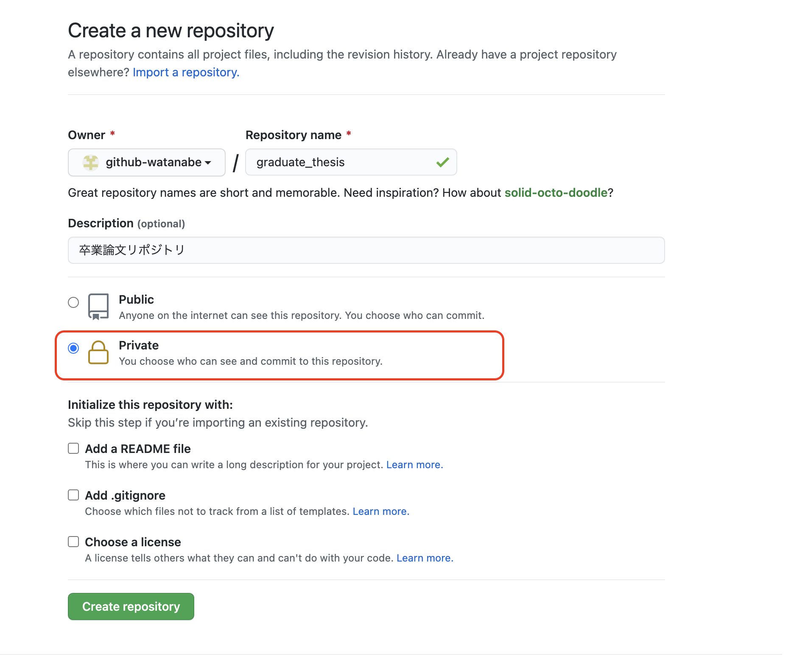
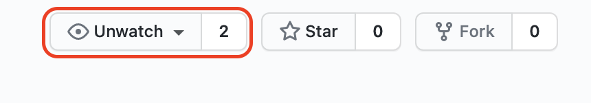

# 卒業論文の準備

卒業論文のテンプレートをダウンロードし、リポジトリとして管理、指導教員をコラボレータとして招待する。あらかじめ[LaTeXのインストール](../latex/README.md)を参照して、LaTeXの環境を整えておくこと。また、ホームディレクトリに`github`というディレクトリが作られており、その下にリポジトリを作ることを想定しているが、異なるディレクトリ構成をしている場合は適宜読み替えること。

## 卒業論文の書き方

以下のスライドを参照。

[主に数値計算系の卒論の書き方](https://speakerdeck.com/kaityo256/happy-writing)

## リポジトリの作成

どこでも良いが、たとえば`github`ディレクトリにて卒論リポジトリをクローンする。

```sh
cd
cd github
git clone https://github.com/kaityo256/graduate_thesis.git
```

ターミナルで上のディレクトリに移動し、VS Codeでフォルダを開く。

```sh
code .
```

VS Codeで`thesis.tex`を開き、ビルドが通ることを確認する。次に、指導教員、名前、学籍番号を修正の上でもう一度ビルドする。

ビルドが通ったら、ターミナルで

```sh
rm -rf .git
```

を実行し、リポジトリの情報を削除する。その上で、新たにGitリポジトリを作成する。

```sh
git init
git add .
git commit -m "Initial commit"
```

これが卒論のリポジトリとなる。

## GitHubへのpush

次に、卒論リポジトリをGitHubにpushする。[GitHub](https://github.com/)にアクセスし、新しくリポジトリを作成せよ。

名前は先程設定したディレクトリ名と一致させる。Descriptionは適当でよいが「卒業論文リポジトリ」と書いておくとわかりやすいだろう。また、Privateリポジトリに設定するのを忘れないこと。



準備が整ったら「Crate repository」をクリックし、現れた3つの選択肢から「…or push an existing repository from the command line」の内容をコピペして、ターミナルで実行する。こんな感じになるはず(`username`は自分のGitHubアカウント名に変更すること)。

```sh
git remote add origin git@github.com:username/graduate_thesis.git
git branch -M main
git push -u origin main
```

pushしたら、リポジトリの当該ページをリロードして、内容があることを確認しよう。

## コラボレータの追加

卒論リポジトリ(graduate_thesis)の、上のメニューの「Settings」をクリックし、左側に現れた「Collaborators」をクリックする。
すると、「Manage access」の下に「Add people」ボタンが現れるので押す。
現れた画面の検索画面に指導教員のアカウント(kaityo256)を入れて、現れたアカウントを選び、「Add kaityo256 to this repository」をクリックして追加する。

すると、教員に招待状が飛び、教員が承諾するとリポジトリのWatchersが二人に増える。



これで招待は完了である。あとはガンガン卒論を書くだけ。
