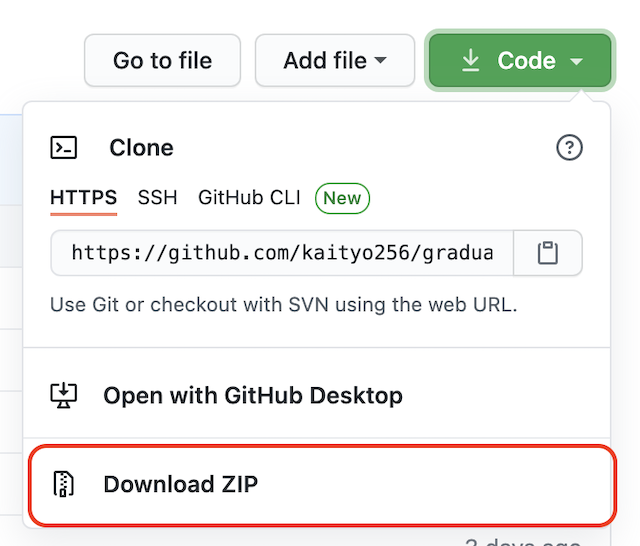
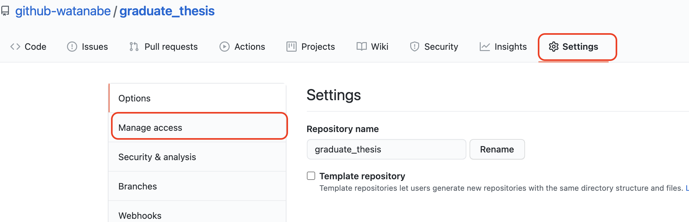
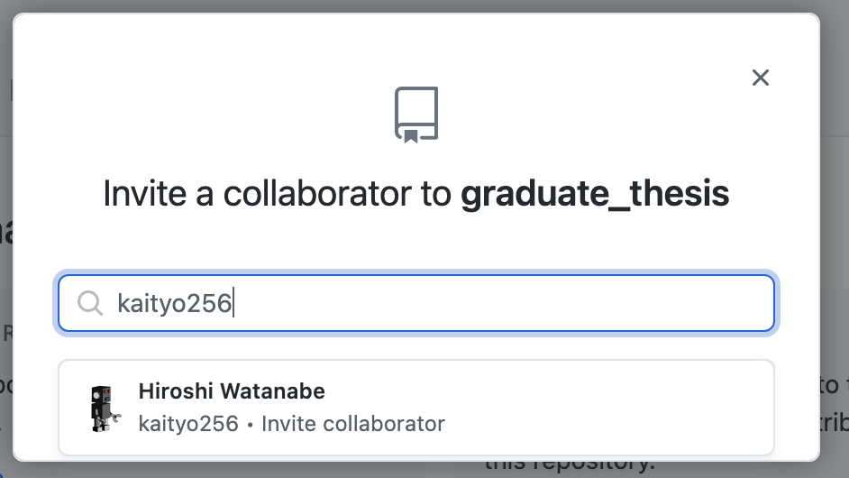

# 卒業論文の準備

卒業論文のテンプレートをダウンロードし、リポジトリとして管理、指導教員をコラボレータとして招待する。あらかじめ[LaTeXのインストール](../latex/README.md)を参照して、LaTeXの環境を整えておくこと。また、ホームディレクトリに`github`というディレクトリが作られており、その下にリポジトリを作ることを想定しているが、異なるディレクトリ構成をしている場合は適宜読み替えること。

## リポジトリの作成

まず[kaityo256/graduate_thesis](https://github.com/kaityo256/graduate_thesis)にアクセスし、リポジトリをダウンロードする。Forkやcloneではないことに注意。



`graduate_thesis-main.zip`というファイルがダウンロードされるはずなので、`~/github`以下に展開する。

例えばMacで「ダウンロード」に保存したのなら

```sh
cd github
cp ~/Download/graduate_thesis-main.zip
unzip graduate_thesis-main.zip
```

で展開できる。

Windowsなら、例えばデスクトップに保存し、右クリックの「全て展開」すると、`graduate-thesis-main`というディレクトリの中にさらに`graduate-thesis-main`というディレクトリが作られるので、内側の方をgithubディレクトリにコピーする。

ディレクトリの名前を`graduate-thesis-main`から好きな名前に変える。`sotsuron`でも`bachelor-thesis`でもなんでも良いが、特に希望がなければ``graduate-thesis`などにする。

ターミナル(WindowsならGit Bash)で上のディレクトリに移動し、VS Codeでフォルダを開く。

```sh
code .
```

VS Codeで`thesis.tex`を開き、ビルドが通ることを確認する。次に、指導教員、名前、学籍番号を修正の上でもう一度ビルドする。

ビルドが通ったら、ターミナルで

```sh
git init
git add *
git add .gitignore
git commit -m "Initial commit"
```

として、Gitリポジトリを作る。これが卒論のリポジトリとなる。なお、`.gitignore`が含まれているため、「以下のファイルは無視したよ。追加したければ `-f`つけな」的なメッセージが出るが気にしなくてよい。最初の`git add *`では`.gitignore`が追加されないので、それも個別に追加している。

## GitHubへのpush

次に、卒論リポジトリをGitHubにpushする。[GitHub](https://github.com/)にアクセスし、新しくリポジトリを作成せよ。

名前は先程設定したディレクトリ名と一致させる。Descriptionは適当でよいが「卒業論文リポジトリ」と書いておくとわかりやすいだろう。また、Privateリポジトリに設定するのを忘れないこと。


準備が整ったら「Crate repository」をクリックし、現れた3つの選択肢から「…or push an existing repository from the command line」の内容をコピペして、ターミナルで実行する。こんな感じになるはず(`username`は自分のGitHubアカウント名に変更すること)。

```sh
git remote add origin git@github.com:username/graduate_thesis.git
git branch -M main
git push -u origin main
```

pushしたら、リポジトリの当該ページをリロードして、内容があることを確認しよう。

## コラボレータの追加

卒論リポジトリの「Settings」の「Manage access」を開く。



現れた画面の「Invite a collabolator」をクリックし、検索画面に指導教員のアカウント(kaityo256)を入れて、現れたアカウントを選び、「Add kaityo256 to this repository」をクリックして追加する。



すると、教員に招待状が飛び、教員が承諾するとリポジトリのWatchersが二人に増える。


これで招待は完了である。あとはガンガン卒論を書くだけ。
