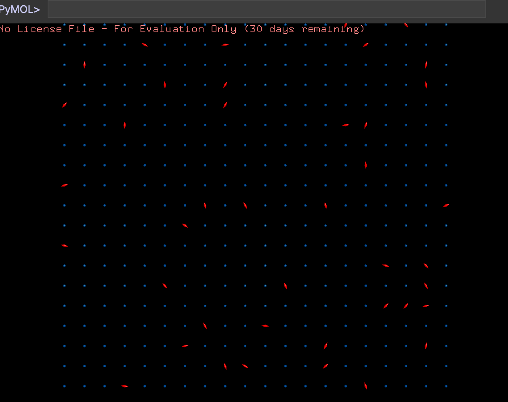

# LammpsとVMDのインストール

Lammps (Large-scale Atomic/Molecular Massively Parallel Simulator)は、サンディア国立研究所の古典分子動力学プログラムだ。性能が良く、比較的容易に使えて、並列化もなされているため、広く使われている。

## Windows編

### Lammpsのインストール

まずは[ここ](https://rpm.lammps.org/windows/)からLammpsをダウンロードしよう。並列版もあるが、とりあえずはシリアル版(並列化されていない)として、`LAMMPS-64bit-stable.exe`をダウンロードして、実行する。「WindowsによってPCが保護されました」というダイアログが出てきたら、「詳細情報」を押すと「実行」が出てくるので、それをクリックしてインストールする。

インストールが完了したら、サンプルコードを実行してみよう。

Lammpsのサンプルファイルは`C:\Program Files\LAMMPS 64-bit 3Mar2020\Examples`にある。そこに移動して「melt」というフォルダをコピーしよう。

その後、自分のユーザフォルダに移動する。エクスプローラーで、「PC」→「Windows (C:)」→「ユーザー」→「自分のアカウント名」でいけるはず。

そこに「lammps」というフォルダを作り、その中に入ってから、先ほどコピーした「melt」を貼り付けよう。

次に、Windows Powershellを起動する。デフォルトでユーザーフォルダが表示されるはず。そこで、

```sh
cd lammps
cd melt
```

としてから、`ls`と打ってみよう。正しくコピーされていれば、以下のような表示になるはず。

```txt


    ディレクトリ: C:\Users\watanabe\lammps\melt


Mode                LastWriteTime         Length Name
----                -------------         ------ ----
-a----       2020/03/06      2:02            596 in.melt
-a----       2020/03/06      2:02           2939 log.27Nov18.melt.g++.1
```

この状態で、以下を実行しよう。

```sh
cat .\in.melt | lmp_serial.exe
```

いろいろ表示されて、最後に

```txt
Total # of neighbors = 151513
Ave neighs/atom = 37.8783
Neighbor list builds = 12
Dangerous builds not checked
Total wall time: 0:00:00
```

といった表示が出れば実行は成功だ。

### in.meltの修正

次に、`in.melt`を修正しよう。

PowerShellで当該フォルダを開いているのなら、

```sh
code in.melt
```

と入力すれば、VSCodeで直接`in.melt`が開かれるはず。

また、コピーした(ユーザーフォルダの下にある)`melt`フォルダの中の`in.melt`ファイルを右クリックしよう。VSCodeが正しくインストールされていれば「Codeで開く」という項目があるはずだ。それを選ぶと、`in.melt`ファイルがVSCodeで開かれるはずである。

コマンドライン(Windows Powershell)から開く方法と、こうしてエクスプローラーから開く方法の両方が使えるようになって欲しい。

VSCodeでin.meltを開いたら、以下の行を探す。

```sh
#dump		id all atom 50 dump.melt
```

この行頭の`#`を削除して保存しよう。

```sh
dump		id all atom 50 dump.melt
```

この状態で、またlammpsを実行しよう。

```sh
cat .\in.melt | lmp_serial.exe
```

すると、今度は同じフォルダに`melt.dump`が作成されたはずだ。`ls`で確認せよ。

これは原子の起動を保存したファイルで、これを後からVMDで読み込んで可視化する。

### VMDのインストール

次にVMDをダウンロード、インストールしよう。

[ここ](https://www.ks.uiuc.edu/Research/vmd/)に行って、「Download (all versions)」をクリックする。

次に「Version 1.9.3 (2016-11-30) Platforms:」の、「Windows OpenGL (Microsoft Windows XP/Vista/7/8/10 (32-bit) using OpenGL)」を選ぶ。

すると、「Registration/Login」画面が現れるので、メールアドレスと、適当なパスワードを入力する。初回登録時には「New User Registration」画面となるので、必要事項を入力の上で「Register」を押す。

ライセンスに同意することを示すと、ダウンロードが始まる。ダウンロードが完了したら、インストールする。特に設定項目はない。

Windows 10なら、左下の「ここに入力して検索」で「vmd」で検索すればVMDが起動する。

VMDが起動したら、「VMD Main」の「File」から「New Molecule」を選び、「Browse」を押して先ほどの`dump.melt`を選ぶ。file typeとして「LAMMPS Trajectory」を選んでから「Load」を押す。


すると、直線が多数重なったような画面が出たはずだ。この状態で、「VMD Main」の画面で「dump.melt」の行を選び、「Graphics」の「Representation」を選ぶ。

ここで、「Drawing Method」を「VDW」にすると、画面が玉に変わるはず。その状態で「Sphere Scale」を小さくしよう。0.3くらいがちょうどよいと思う。


この状態で、VMD Mainの右下にある再生ボタン「Play Forward」を押せば、原子が凍った状態から解けていくアニメーション(6フレームしかないが)が表示されるはずだ。

## Mac編

### Lammpsのインストール

「ターミナル」で以下を実行しよう。

```sh
brew install lammps
```

その後、ターミナルから`lammps`ディレクトリを作り、そこに移動する。

```sh
mkdir lammps
cd lammps
```

次に、サンプルディレクトリをコピーしよう。

```sh
cp -r /usr/local/Cellar/lammps/2020-03-03/share/lammps/examples/ellipse .
```

長いが、タブ補完を駆使すれば入力が楽になるだろう。

できた`ellipse`ディレクトリに入って、lammpsを実行しよう。

```sh
cd ellipse
lmp_serial < in.ellipse.gayberne
```

いろいろ表示されて、最後に

```txt
Total # of neighbors = 3096
Ave neighs/atom = 7.74
Neighbor list builds = 46
Dangerous builds = 0

Please see the log.cite file for references relevant to this simulation

Total wall time: 0:00:01
```

といった表示が出れば実行は成功だ。

### 入力ファイルの修正

次に、入力ファイルを修正しよう。ターミナルで`in.ellipse.gayberne`があるディレクトリがカレントディレクトリになっている状態で、

```sh
code in.ellipse.gayberne
```

と入力すると、VSCodeで`in.ellipse.gayberne`が開かれるはず。もし`command not found`と言われたら、まずVSCodeを開き、Shift+Command+Pで「コマンドパレット」を開いて「shell」で検索して「シェルコマンド: PAHT内にVS Codeをインストールします (Shell Command: Install code command in PATH)」を選択し、実行する。その後、再度先程の命令を実行すると、VSCodeで`in.ellipse.gayberne`が開かれるはず。

VSCodeでin.ellipse.gayberneを開いたら、以下の行を探す。

```sh
#dump	     1 all custom 100 dump.ellipse.gayberne &
#	     id type x y z c_q[1] c_q[2] c_q[3] c_q[4]
```

この二行の行頭の`#`を削除して保存しよう。

```sh
dump	     1 all custom 100 dump.ellipse.gayberne &
	     id type x y z c_q[1] c_q[2] c_q[3] c_q[4]
```

この状態で、またlammpsを実行しよう。

```sh
lmp_serial < in.ellipse.gayberne 
```

すると、今度は同じディレクトリに`dump.ellipse.gayberne`ができているはず(`ls`で確認しよう)。

これは原子の起動を保存したファイルで、これを後からPyMolで読み込んで可視化する。

### PyMolのインストール

本当はVMDを使う予定だったのだが、最新のMacでVMDが動かないことがわかったので、とりあえずPyMolでしのぐことにする。

[ここ](https://pymol.org/2/)からmacOSのディスクイメージをダウンロードし、PyMolをアプリケーションにコピーしてインストールせよ。

その後PyMolを起動すると、Activationについて聞いてくるので、とりあえず「Skip Activation」を選ぶ(30日間の試用期間に入る)。

次に、LammpsのdumpファイルをPyMolのファイルに変換する。ターミナルで以下のディレクトリに移動せよ。

```sh
cd /usr/local/Cellar/lammps/2020-03-03/share/lammps/tools/pymol_asphere/src
```

そこで

```sh
make
```

を実行すること。すると、実行可能ファイルができるので、それをパスが通ったところにシンボリックリンクを作ろう。

```sh
cd /usr/local/bin 
ln -s /usr/local/Cellar/lammps/2020-03-03/share/lammps/tools/pymol_asphere/bin/asphere_vis
```

次に、色ファイルを設定する。先程、シミュレーションを実行したディレクトリに移動して、`colors.ellipse`ファイルを作成しよう。

```ls
cd
cd lammps
cd ellipse
code colors.ellipse
```

VSCodeが開き、`colors.ellipse`が新規作成されたはずだ。ファイルの中身は以下のように記入せよ(最後の改行を忘れないこと。全体で3行になる)。

```txt
1 marine 0.7 1
2 red 1.0 3 1 1

```

上記を保存したら、ターミナルで以下を実行せよ。

```sh
asphere_vis colors.ellipse dump.ellipse.gayberne ellipse.py -r 4 -o
```

以下のように出力されたら成功だ。

```txt
Read in 2 atom types from flavor_file.
Wrote 41 frames to output file.
```

もし、以下のように「1 atom」しか認識されなかった場合、最後の改行を忘れているので、再度ファイルを修正すること。

```txt
Read in 1 atom types from flavor_file.
Wrote 41 frames to output file.
```

このスクリプトにより`ellipse.py`が作成されたはずである(`ls`で確認せよ)。

PyMolの「File」「Run Script」から、先程作成した`ellipse.py`を選んで実行すると、こんな画面が表示されるはずだ。



この状態で右上にある「Play」をクリックすると、アニメーションが表示されるはずである。
