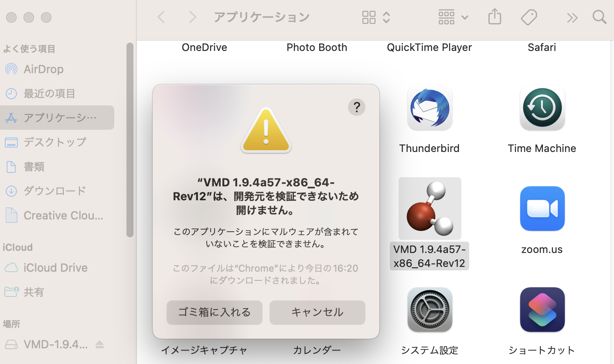
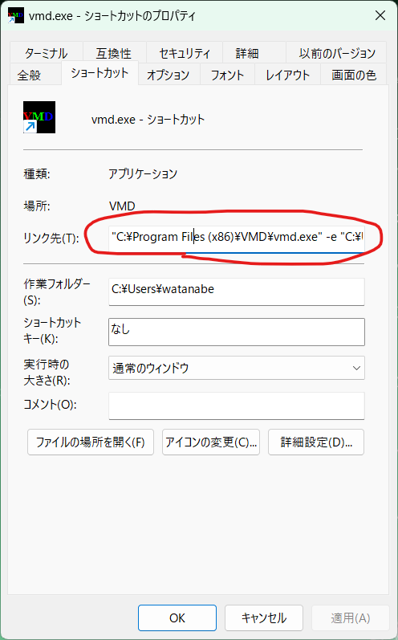

# LammpsとVMDのインストール

Lammps (Large-scale Atomic/Molecular Massively Parallel Simulator)は、サンディア国立研究所の古典分子動力学プログラムだ。性能が良く、比較的容易に使えて、並列化もなされているため、広く使われている。

## Lammpsのインストール

### Windows

WSLのターミナルで以下を実行する。

```sh
sudo apt update
sudo apt install -y lammps
```

これにより、`lmp`という実行バイナリがインストールされる。バージョンを確認しよう。

```sh
$ echo info | lmp
LAMMPS (20 Nov 2019)

Info-Info-Info-Info-Info-Info-Info-Info-Info-Info-Info
Printed on Mon Apr 22 18:08:04 2024


Info-Info-Info-Info-Info-Info-Info-Info-Info-Info-Info

Total wall time: 0:00:00
```

以下、`lmp_serial`を`lmp`と読み替えて実行すること。

### Mac

「ターミナル」で以下を実行しよう。

```sh
brew install lammps
```

インストールが完了したら以下を実行せよ。

```sh
$ echo info | lmp_serial  
LAMMPS (29 Oct 2020)

Info-Info-Info-Info-Info-Info-Info-Info-Info-Info-Info
Printed on Tue Mar 30 16:29:46 2021


Info-Info-Info-Info-Info-Info-Info-Info-Info-Info-Info

Total wall time: 0:00:00
```

上記のようなバージョン情報が表示されれば問題なくインストールされている。

### 研究室サーバで実行する場合

以下を実行せよ。

```sh
export PATH=$PATH:/home/apps/lammps
```

これにより、`lmp_serial`や、MPI版である`lmp_mpi`が使えるようになる。

## VMDのインストール

### Windows

次にVMDをダウンロード、インストールしよう。

[ここ](https://www.ks.uiuc.edu/Research/vmd/)に行って、「Download (all versions)」をクリックする。

次に「Version 1.9.4 LATEST ALPHA (2022-04-27) Platforms:」の、「Windows 64-bit, CUDA, OptiX, OSPRay (64-bit Intel x86_64) (Windows 10)」を選ぶ。

すると、「Registration/Login」画面が現れるので、メールアドレスと、適当なパスワードを入力する。初回登録時には「New User Registration」画面となるので、必要事項を入力の上で「Register」を押す。

ライセンスに同意することを示すと、ダウンロードが始まる。ダウンロードが完了したら、インストールする。特に設定項目はない。インストール後に実行したら、以下のように「VMD」の文字が回転する画面が表示されれば成功である。


もしインストール後に実行してもエラーが起きて開けなかった場合、アンインストールして32-bit版をインストールする。具体的には[VMDダウンロードページ](https://www.ks.uiuc.edu/Development/Download/download.cgi?PackageName=VMD)に行って、「Windows OpenGL (32-bit Intel x86) (Microsoft Windows XP/Vista/7/8/10 (32-bit) using OpenGL)」をダウンロードする。32-bitで、かつCUDAを使っていないものを選ぶこと。

### Mac

[ここ](https://www.ks.uiuc.edu/Research/vmd/)に行って、「Download (all versions)」をクリックする。

M1 Macの場合は「MacOS 11.x, ARM64 (64-bit "M1" Macs) (Apple MacOS-X 11 or later)」を選ぶ。

すると、「Registration/Login」画面が現れるので、メールアドレスと、適当なパスワードを入力する。初回登録時には「New User Registration」画面となるので、必要事項を入力の上で「Register」を押す。

ライセンスに同意することを示すと、ダウンロードが始まる。ダウンロードが完了したら、ディスクイメージファイル(dmgファイル)をクリックせよ。このような画面が出るはずだ。


この画面を開いた状態で、Finderでアプリケーションを表示し、VMDをアプリケーションフォルダにドラッグしてコピーする。

その後、「システム設定」の「プライバシーとセキュリティ」を開いた状態で、アプリケーションフォルダにあるVMDをダブルクリックして起動する。


すると、「開発元を検証できないため開けません」という画面がでる。




ここで「システム環境設定」の「プライバシーとセキュリティ」を開きながら「キャンセル」を押すと、「プライバシーとセキュリティ」に「"VMD ..."は開発元を確認できないため、使用がブロックされました。」と表示されるので、そこに現れる「このまま開く」ボタンを押す。


するとパスワードが要求されるので入力し、もう一度確認画面がでるのでOKを押すと、VMDが起動する。VMDをアプリケーションフォルダにコピーしておけば、二度目からは確認されない。

最終的に、以下のように「VMD」の文字が回転する画面が表示されれば成功である。


## VMDによる可視化

### サンプルファイルのクローン

まず、LAMMPSの可視化サンプルをクローンする。

```sh
cd github
git clone https://github.com/kaityo256/lammps_samples.git
cd lammps_samples
```

### 衝突シミュレーション

まず、`collision`ディレクトリに移動して、`python3 generate_config.py`を実行することで、原子の初期配置ファイル`collision.atoms`を生成する。

```sh
cd collision
python3 generate_config.py
```

その後、LAMMPSの実行ファイルである`lmp_serial`に`collision.input`を与えて実行する。

```sh
lmp_serial < collision.input
```

すると、以下のような出力がされる。

```txt
LAMMPS (10 Mar 2021)
Reading data file ...
  orthogonal box = (-40.000000 -20.000000 -20.000000) to (40.000000 20.000000 20.000000)
  1 by 1 by 1 MPI processor grid
  reading atoms ...
  4696 atoms
(snip)
Total # of neighbors = 155660
Ave neighs/atom = 33.147359
Neighbor list builds = 399
Dangerous builds = 0
Total wall time: 0:00:47
```

概ね、1分以内に実行が終わるはずである。実行後、`collision.lammpstrj`というファイルが生成されているので、これをVMDに読み込ませて可視化する。

ファイルの読み込みについて、WindowsとMacで少々手続きが異なる。

#### Mac

VMDを起動し、「VMD Main」の「File」から「New Molecule」を選び、「Browse」を押して作業ディレクトリへ移動し、`collision.lammpstrj`を選んでから「Load」を押す。

稀に、Macにおいてマウスが使えない(クリックが効かない)場合がある。その場合はVMDコマンドプロンプトを使う方法を試すこと。

#### Windows

WindowsではLAMMPSをWSL上で実行するが、VMDからWSLのディレクトリを開くのがやや面倒だ。以下の二つの方法を紹介する。

* カレントディレクトリを指定してVMDを実行する方法
* カレントディレクトリをコピーしてVMDから開く方法

まず、WSLで開きたいlammpstrjファイルが存在するディレクトリで

```sh
open .
```

を実行し、そのフォルダを開く。まだopenをエイリアス設定していない場合は

```sh
alias open=explorer.exe
```

としておくこと。`.bashrc`に記載しておくことが望ましい。

フォルダが開いたら、パスが表示されている場所に「vmd」と入力すると、このディレクトリをカレントディレクトリとしてVMDが起動する。


VMDが起動したら、「VMD Main」の「File」から「New Molecule」を選び、「Browse」を押して`collision.lammpstrj`を選んで「LOAD」を押す。拡張子が`lammpstrj`であれば、file typeとして「LAMMPS Trajectory」が自動で選択される。


上記の方法でVMDがうまく起動しない場合は、エクスプローラーで作業ディレクトリを開き、そのパスをコピーする。その後、VMDを起動して、「File」から「New Molecule」を選び、「Browse」を押してから、先ほどコピーしたパスを貼り付けると、`collision.lammpstrj`ファイルが見つかるはずなので、それを選択して「LOAD」を押す。

### 気泡シミュレーション

`lammps_samples`の中の`bubble`の中のファイルを実行する。

```sh
cd bubble
python3 generate_config.py
lmp_serial < bubble.input
```

すると`bubble.lammpstrj`が生成されるので、VMDで読み込む。

その後「Graphics」の「Represenation」から「Graphical Representation」ウィンドウを開く。

「Style Color Selection」とある下の「all」を含む行が選ばれた状態で、「Selected Atoms」の下の欄に以下を入力し、エンターキーを押してみよ。

```txt
-2 < z and z < 2
```

実は穴が空いており、しばらく後に穴がふさがっていく様子が見えるはずである。不安定性が起きている時に断面の様子を観察したい時などに有用である。

### 相分離シミュレーション

`lammps_samples`の中の`phase_separation`の中のファイルを実行する。

```sh
cd phase_separation
python3 generate_config.py
lmp_serial < phase_separation.input
```

すると`phase_separation.lammpstrj`が生成されるので、VMDで読み込む。すると、二種類の原子がランダムに配置された状態から相分離していく様子が見える。

その後「Graphics」の「Represenation」から「Graphical Representation」ウィンドウを開く。

「Style Color Selection」とある下の「all」を含む行が選ばれた状態で、「Selected Atoms」の下の欄に以下を入力し、エンターキーを押してみよ。

```txt
type=1
```

すると、二種類の原子のうち「Type 1」の原子のみが表示される。同様に、

```txt
type=2
```

とすると「Type 2」の原子のみ表示される。多数の溶媒中に溶質が溶けているような系で、溶質のみ表示したい時などに有用である。

### VMDコマンドプロンプト

VMDを起動すると、以下のように表示されるターミナルも合わせて開く。

```sh
Info) VMD for WIN32, version 1.9.4a48 (October 13, 2020)
(snip)
vmd >  
```

この`vmd > `とあるのがVMDのコマンドプロンプトであり、多くの操作をここから実行できる。慣れるとウィンドウ操作よりも早い。

このコマンドプロンプトで、`cd`で作業ディレクトリに移動し、`mol new filename.lammpstrj`を実行することでファイルを読み込むことができる。

#### Mac

Macの場合、ターミナルの作業ディレクトリで`pwd`を実行する。すると、例えば以下のような表示がされる。

```sh
$ pwd
/home/watanabe/github/lammps_samples/collision
```

この`/home/...`をコピーして、VMDのコマンドプロンプトにて以下を実行する。

```sh
cd /home/watanabe/github/lammps_samples/collision
```

その後、

```sh
mol new collision.lammpstrj
```

を実行すると、`collision.lammpstrj`が読み込まれる。

#### Windows

Windowsの場合は、WSLのパスをVMDに分かるように修正し、さらにバックスラッシュ`\`を二つ重ねて`\\`にして、さらにダブルクオーテーションマークで囲む必要がある。例えば、WSL側のパスが

```sh
/home/watanabe/github/lammps_samples/collision
```

であるならば、VMDコマンドプロンプト上で

```sh
cd "\\\\wsl.localhost\\Ubuntu\\home\\watanabe\\github\\lammps_samples\\collision"
```

を実行する必要がある。これらを毎回手で変換するのは手間なので、例えば以下のワンライナーを実行すると良い。

```sh
echo "\"$(wslpath -w $(pwd) | sed 's/\\/\\\\\\\\/g')\""
```

すると`"\\\\wsl.localhost\\Ubuntu\\home\\watanabe\\github\\lammps_samples\\collision"`などの表示がされるため、これをコピーしてVMDでcdすれば良い。


その後、

```sh
mol new collision.lammpstrj
```

を実行すると、`collision.lammpstrj`が読み込まれる。

#### 可視化手法の修正

`collision.lammpstrj`をロードしたら、直線が多数重なったような画面が出たはずだ。この状態で、「VMD Main」の画面で「collision.lammpstrj」の行を選び、「Graphics」の「Representation」を選ぶ。そして、「Drawing Method」を「VDW」にすると、画面が玉に変わるはず。その状態で「Sphere Scale」を小さくしよう。0.3くらいがちょうどよいと思う。


この状態で、VMD Mainの右下にある再生ボタン「Play Forward」を押せば、液滴が衝突のシミュレーションが表示される。マウスでドラッグすると角度を変えられるので試してみよ。


## VMDの初期設定

ほとんどの場合、可視化方法としてVDW(ファンデルファールス)を選ぶと思われるが、毎回指定するのは面倒だ。以下、デフォルトで粒子のDrawing MethodをLinesからVDWにする方法を説明する。

### Mac

Macは簡単であり、ホームディレクトリに

```txt
mol default style VDW
menu main on
```

という内容の`.vmdrc`ファイルを作ればよい。このファイルはVMDが起動時に自動的に読み込まれるため、デフォルトスタイルがVDWになる。

### Windows

Windowsでは、VDWの作業ディレクトリがデフォルトで`C:\Program Files (x86)\VMD\`になってしまうので面倒だ。
そこで、VDWのショートカットを作成し、その「リンク先」として`.vmdrc`を指定する。

まず、以下の内容の`.vmdrc`を作成する。

```txt
mol default style VDW
menu main on
```

このファイルを(Ubuntuではなく)Windowsのホームディレクトリへコピーする。Windowsのホームディレクトリは、`C:\Users\name`という名前になっている。ここでは`c:\Users\watanabe`であるとする。

WSLのUbuntuから作成したのなら、以下のようにしてUbuntu側からWindows側にコピーできる。

```sh
 cp .vmdrc /mnt/c/Users/watanabe
```

アカウント部分は適宜修正すること。

次に、VMDのショートカットを作成する。

`C:\Program Files (x86)\VMD`にある`vmd.exe`を右クリックし「その他のオプション」から「ショートカットの作成」を選ぶと、「ここにショートカットを作成することはできません。デスクトップ上に作成しますか？」と聞かれるので「はい」を選ぶ。

デスクトップに作成された「vmd.exe - ショートカット」を右クリックし、プロパティを開いて「リンク先」を以下のように修正する。

```txt
"C:\Program Files (x86)\VMD\vmd.exe" -e "C:\Users\watanabe\.vmdrc"
```


アカウント名は適宜修正すること。

これにより、このショートカットをダブルクリックすることで、VMDが`.vmdrc`を読み込んだ状態で起動する。
