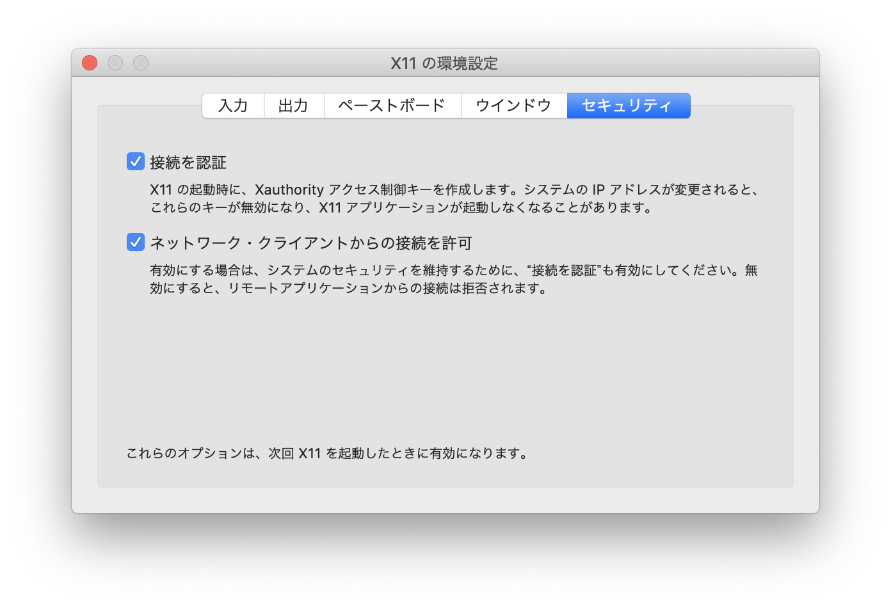

# MacでVMD

以前のMacはVMDが対応していなかったのでDocker経由で実行していたが、現在は対応したので以下の情報は不要。

## XQuartzのインストール

まず、XQuartzをインストールしよう。[ここ](https://www.xquartz.org/)から、`XQuartz-2.7.11.dmg`をダウンロード、インストールする。

XQuartzは「アプリケーション」→「ユーティリティ」にインストールされるので起動する。「xterm」というウィンドウが開けばインストールできてる。

その後、XQuartzの「環境設定」の「セキュリティ」タブで、「接続を認証」と「ネットワーク・クライアントからの接続を許可」の両方にチェックを入れる(デフォルトで「接続を認証」にはチェックが入っているはず)。



さらに、ターミナルから

```sh
defaults write org.macosforge.xquartz.X11 enable_iglx -bool true
```

を実行しておく。以上の変更を適用するためにXQuartzを再起動すること。

## Dockerのインストール

次に、Dockerをインストールする。[ここ](https://www.docker.com/products/docker-desktop)から「Download for Mac」→「Get Docker」でダウンロードできるのでインストールする。

インストール後、Dockerを起動する。最初にDocker IDの入力を求められるウィンドウが出るが、無視して消して良い。右上にクジラのような小さいアイコンが表示されたらDockerが起動している。

Dockerの動作を確認しよう。ターミナルで、

```sh
docker ps
```

を実行し、

```txt
CONTAINER ID        IMAGE               COMMAND             CREATED             STATUS              PORTS               NAMES
```

と表示されたらDockerが起動している。

```txt
Error response from daemon: dial unix docker.raw.sock: connect: connection refused
```

と表示されたらDockerが起動していないので起動すること。

## Dockerイメージの作成

まず、Dockerイメージ作成用のディレクトリを作成し、そこにDockerfileをダウンロードしよう。

```sh
cd
mkdir docker-vmd
cd docker-vmd
wget https://kaityo256.github.io/lab_startup/lammps/Dockerfile
```

次に、Linux版のVMDをダウンロードする。[ここ](https://www.ks.uiuc.edu/Research/vmd/)に行って、「Download (all versions)」をクリックする。

次に「Version 1.9.4 LATEST ALPHA (2019-10-17) Platforms:」の「LINUX_64 OpenGL, CUDA, OptiX, OSPRay」を選ぶ。すると、「Registration/Login」画面が現れるので、メールアドレスと、適当なパスワードを入力する。初回登録時には「New User Registration」画面となるので、必要事項を入力の上で「Register」を押す。

ライセンスに同意することを示すと、ダウンロードが始まる。ダイアログが出たら「Save File」を選ぶこと。ダウンロードが完了したら、ダウンロードしたファイルを、先程作成したディレクトリ`docker-vmd`にコピーする。例えば、「ダウンロード」フォルダにダウンロードされたなら、

```sh
cp ~/Downloads/vmd*.tar.gz .
```

で現在のディレクトリにコピーされるはずである。

現在、`~/docker-vmd`ディレクトリには、以下のDockerファイルとtar.gzファイルの2つのファイルがあるはず。

```sh
$ ls
Dockerfile  vmd-1.9.4a38.bin.LINUXAMD64-CUDA10-OptiX600-RTX-OSPRay170.opengl.tar.gz
```

この状態でDockerイメージをビルドする。

```sh
docker build -t vmd .
```

最後に

```txt
Successfully tagged vmd:latest
```

と表示されたら正しくビルドされている。

次に、先程の`melt`ディレクトリに移動して、以下のコマンドを実行する。

```sh
cd
cd lammps
cd melt
docker run -e DISPLAY=$(hostname):0 -v ~/.Xauthority:/root/.Xauthority -v $(pwd):/lammps -it vmd
```

ここまで正しく実行されていればVMDが起動したはずである。

```txt
Can't open display: watanabe-mbp.local:0
```

などと言われたらXQuartzが起動していないので起動せよ。
