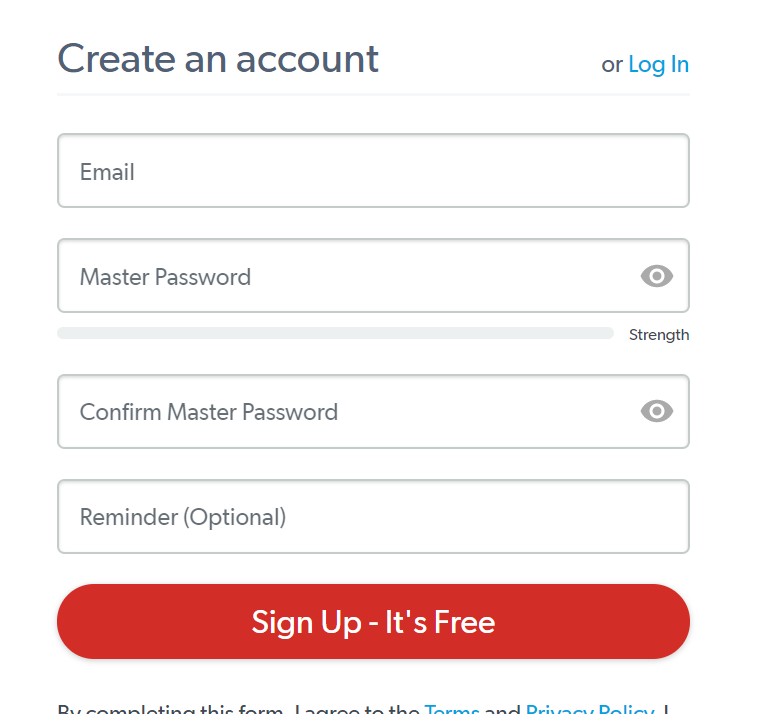
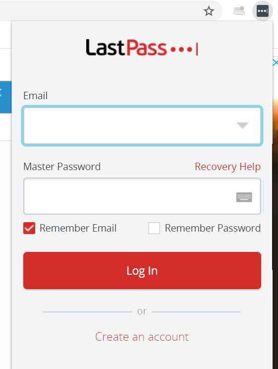
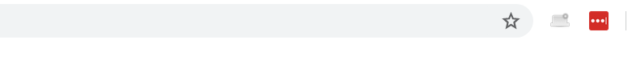
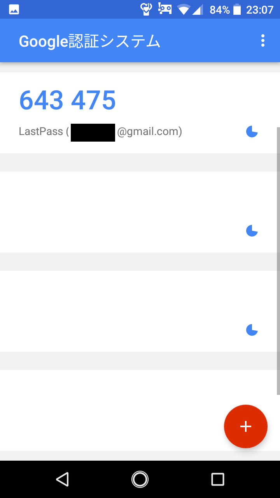

# LastPassと多要素認証

## はじめに

これから、GitHubをはじめとして、MendeleyやGrammerlyなど、いくつかの「アカウント」を管理することになる。この時、パスワードを個別に管理するのは煩わしいし、かといってパスワードの使いまわしをするのはセキュリティ的に問題がある。

こういう問題の一つの解決法として、「強く守った一つのアカウントに、他のパスワードを記録する」という方法がある。例えば、何かのサイトで「Googleでログイン」や「Twitterでログイン」というのを見たことがあるだろう。これは「Google」や「Twitter」のアカウントは「守られている」ことを仮定して、ユーザ認証をそちらに任せる仕組みだ(詳細については「OAuth」で検索してみよ)。

他にも、「パスワードを忘れた」というボタンがついているサイトも多い。このボタンを押すと、登録されているメールアドレスにパスワードの初期化用の手段が贈られてくるが、これは「メールアカウントは守られている」ことを仮定している。

このように、「あるメインのアカウントは強く守っておき、他のアカウントはメインのアカウントに認証を任せる」方法は有効である。この哲学に従い、複数のパスワードを、一つのパスワードマネージャに管理させよう。

パスワードマネージャはなんでも良いが、

* 無料である
* 複数のデバイスから同じデータにアクセスできる(クラウド対応)
* 多要素認証に対応している

をすべて満たす「LastPass」をおすすめする(他には、1Password等が有名)。もちろん、好きなものを使ってよい。

パスワードのクラウド対応については、「パスワードデータがネットワークの向こう側に保存される」ことを不安視する人もいるかもしれない。これについては、「クラウドからパスワードが流出する」リスクと、「パスワードマネージャを使わないことで、パスワードを忘れたり、つい使いまわしたりしてしまうリスク」を比較し、どちらを重視するか、各自で検討して欲しい。以下、パスワードマネージャとしてLastPassを使った場合、多要素認証導入までの方法を紹介する。

## LastPassのインストール

LastPassはブラウザの拡張として使うタイプのパスワードマネージャであるので、普段使うブラウザでアクセスしよう。だいたいのブラウザにはLastPass拡張が用意されていると思うが、特に希望がなければGoogle Chromeを推奨する。

まず、[https://www.lastpass.com/](https://www.lastpass.com/)に行って、「Get LastPass Free」をクリックしよう。



メールアドレス(Email)がアカウント名となる。普段使うメールアドレス(例えばGmail)を設定すること。

マスターパスワードは、最も重要なパスワードとなるので、強いパスワードにすること。LastPassは

* 12文字以上
* 数字を一つ以上含む
* 大文字小文字が混ざる
* メールアドレスにしてはならない

ことを求めており、記号を入れることを必須にしていない。JPCERTも[記号を含めて短い、パスワードが長い方が強度に寄与する](https://www.jpcert.or.jp/pr/stop-password.html)という見解を打ち出している。とりあえず12文字あれば良いだろう。「パスワード生成」などで検索して、適当なサイトでパスワードを作ってから、紙などにメモしておこう(なくさないように)。もしくは、pwgenを使うのも良い。

```sh
brew install pwgen #Macの場合
sudo apt install -y pwgen
```

でインストールし、

```sh
pwgen -y 12
```

などとしよう。Reminderは、パスワードを忘れた時のヒントなので、入力しなくてかまわない。

無事にアカウントが作成されたら「Install LastPass」をクリックして、ブラウザの拡張機能をインストールしよう。Google Chromeならchrome ウェブストアが表示されるはずなので、「拡張機能の追加」をクリックしてブラウザに追加する。他のブラウザでも同様。

正しくインストールされたら、ブラウザの右上にLastPassの黒いアイコンが表示されるはずである。


この黒いアイコンをクリックすると、ログイン画面となるので、先ほど設定したメールとマスターパスワードでログインしよう。



ログインに成功すると、アイコンが赤くなる。



今後、LastPassにログインした状態で何かのサイトにログインすると、LastPassに追加するか聞かれるので、その時に「Add」を選ぶとLastPassがアカウント名とパスワードを覚えていく。他にもいろいろ便利な機能があるが、それについてはおいおい覚えていくと良いだろう。

## 多要素認証

### 二段階認証と多要素認証

パスワードマネージャのアカウントは、他の全てのパスワードを管理する最も重要なアカウントであるから、きちんと守ってやらなければならない。その時に使うのが多要素認証である。

アカウントとパスワードだけの認証では心もとないので、もう一つ何か認証の要素を追加しよう、というのは自然な発想である。

この時、アカウントとパスワードの他に、もう一つ何か知識(例えば生年月日)を求める方法を「二段階認証」と呼ぶ。二段階認証は面倒なわりにセキュリティの向上はあまり見込めない(……のだが、銀行のウェブサイトなどで採用例がある)。

それに対して、多要素認証とは、「アカウントとパスワード」とは質的に異なるものを追加することで認証をセキュアにしよう、という方法論である。

多要素認証には三つの要素がある。

* 知識要素 (What you know) 「あなたしか知らない情報」パスワードや「秘密の質問」などがこれにあたる
* 所持要素 (What you have)「あなたしか持っていない物」スマホを使ったワンタイムパスワードなどがこれにあたる
* 生体要素 (What you are)　「あなた自身」指紋認証、静脈認証、顔認証などがこれにあたる

例えばパスワードの他に「秘密の質問」を使った認証は、どちらも「知識要素」を使っているので二段階認証だが、多要素認証ではない。

それに対して、パスワードの他にスマホを使った認証は、「知識要素」「所持要素」の二つを使っているので多要素認証となる。

以下ではスマホを使った多要素認証を導入する。

### Google Authenticator

まず、スマホに「Google　Authenticator」を導入しよう。iPhoneならApple Store、AndroidならPlay Storeで「Google Authenticator」で検索することで見つかるだろう。


まずこれをインストールしよう。

次に、LastPassで多要素認証を有効にする。

まず、LastPassにログインし、「Open My Vault」を選ぶ(Vaultとは金庫室という意味である)。

左のメニューから「Account Settings」を選ぶ。上のタブから「Multifactor Options」を選ぶ。

一覧から「Google Authenticator」の列の右の鉛筆マークをクリックする。その後、指示に従うと、二次元コードが出てくるはずである。

この状態でスマホを取り出し、Google Authenticatorを起動する。右下に「+」マークをクリックして「バーコードをスキャン」を選ぶと撮影モードになるので、表示されている二次元コードを映すことで追加できる。名前は「LastPass」とかにしておこう。

以後、LastPassにログインしようとすると、パスワード認証の他にGoogle Authenticatorによる認証が要求される。Google Authenticatorを起動すると、先ほど名前をつけて保存した「LastPass」のところに6桁の数字が表示されるので、これを入力しよう。



この数字は一分毎に変わる、ワンタイムパスワードと呼ばれるものになっている。

パスワードマネージャを使うかどうかは個人の自由だが、大事なアカウントを多要素認証で守るのは必須である。今後、GitHubアカウントを作成するが、これも多要素認証で守ること。
