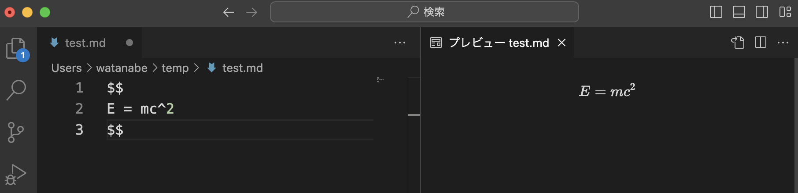

# Markdown記法とLaTeX記法

## 準備

VSCodeを開き、`test.md`という名前でファイルを新規作成せよ。拡張機能(Shift+Ctrl+X)で、「Markdown+Math」をインストールせよ。その状態で、

```tex
$$
E = mc^2
$$
```

と入力し、「Ctrl+K, V (Ctrl+Kを押してから、Ctrlを離してV)」もしくは、コマンドパレットから「Markdown: プレビューを横に表示」を入力せよ。

拡張機能が正しくインストールされていれば、以下の画面のように右側に数式が表示されたはずだ。



以下、VSCodeでプレビューを見ながらMarkdownやLaTeX記法を書いてみる。

## Markdown記法

もともとはプレーンテキストをHTMLに変換することを目的として作られた「マークアップ言語」の一つ。様々な拡張がなされ、今ではPDF他、様々な形式に変換できる。方言が多いのが特徴(問題)。GitHubではMarkdownはHTMLに変換して表示されるため、ドキュメントのデファクトスタンダードになっている。ただし、GitHubではMarkdown中の数式は表示されないので注意。

### 見出し

`#`ではじまる文章は見出しになる。`#`、`##`など、`#`の数で見出しのレベルを表現する。
上の「見出し」は

```md
### 見出し
```

と書いてある。

見出しは、VSCodeではアウトラインとして表示される。アウトラインの表示順は「名前」や「位置」があるが、通常は「位置」でソートした方がわかりやすい。


### 番号つきリスト

「行頭に数字＋ピリオド」で番号付きリストを作ることができる。

```md
1. One
2. Two
3. Three
```

1. One
2. Two
3. Three

Markdownに書く番号そのものは無視される。

```md
1. One
1. Two
1. Three
```

上記のように書いても以下のように表示される。

1. One
1. Two
1. Three

インデントすることで入れ子にできる。

```md
1. One
    1. Hey
    1. Hi!
1. Two
    1. Hey
    2. Hi!
```

1. One
    1. Hey
    1. Hi!
1. Two
    1. Hey
    2. Hi!

### 番号無しリスト

名Bullet listとも。行頭に`*`か`-`をつけることでリストを作ることができる。`*`と`-`は混ぜても良い(推奨しないが)。

```md
* Hey
- Hi
* Hello
```

* Hey
- Hi
* Hello

インデントすることで入れ子にすることもできる。

```md
* Hey
   * Hey
- Hey
   - Hey
```

* Hey
   * Hey
- Hey
   - Hey

番号つきリストと混ぜることもできる。

```md
1. One
    * O
    * n
    * e
2. Two
    * T
    * w
    * o
```
1. One
    * O
    * n
    * e
2. Two
    * T
    * w
    * o

### リンク

`[テキスト](URL)`の形でリンクを作ることができる。

```md
[Yahoo](https://www.yahoo.co.jp)
```

[Yahoo](https://www.yahoo.co.jp)

### 画像

``の形で画像を表示することができる。

[Google](https://www.google.co.jp)に行って、ロゴのURLをコピーして、以下を入力せよ。

```md

```

以下のように表示されるはずだ。


画像はローカルファイルも表示できる。

### コードブロック

バッククォートを三つ続けたもので囲んだものはコードブロックとなる。最初のバッククォートの後に言語名を書くと、シンタックスハイライトされる場合がある。

```py
if a==0:
    print("Hello Python")
```

```cpp
if ( a==0 ){
    printf("Hello C++\n");
}
```

### インライン要素

文の中に埋め込める要素をインライン要素と呼ぶ。

`*`で囲むと強調(イタリック) *強調*

`**` で囲むと強調(ボールド) **強調**

`~~`で囲むと打ち消し ~~打ち消し~~

`` ` ``で囲むとコードブロック `Ruby` 

## 数式

`$` で囲むとインライン数式 $E=mc^2$

`$$`で囲むとブロックの数式

$$
E=mc^2
$$

## LaTeX記法

LaTeXとは「組版システム」である。多くの論文がLaTeXかWordで書かれている。LaTeXは、テキストで記述されたものを印刷に向いた形式に変換するためのシステムだが、その中に数式を表現する記法があり、便利なのでLaTeXから離れて使われるようになっている。

以下、LaTeXの数式記述について簡単に紹介する。

### 基本

アルファベットをそのまま書くとイタリックになる。通常、変数はイタリックで表示する。

```tex
abcdefg
```

$$
abcdefg
$$

`^`で上付き、`_`で下付き文字が表現できる。

```tex
a^2
```

$$
a^2
$$

```tex
x_i
```

$$
x_i
$$

二文字以上を上付き、下付きにしたい場合は中括弧で囲む。

```tex
a^12
```

この例では、最初の1だけが上になり、`a^1 * 2`の意味になってしまう。

$$
a^12
$$

```tex
a^{12}
```

こうすればaの12乗の意味になる。

$$
a^{12}
$$

上付きと下付きを同時につけることもできる。

```tex
x_i^2
```

$$
x_i^2
$$

`^`と`_`の順序はどちらでも良い。

```tex
x^2_i
```

$$
x^2_i
$$

### コマンド

LaTeXは、バックスラッシュから始まるコマンドをもつ。例えばギリシャ文字が入力できる。

```tex
\alpha
\beta
\gamma
\delta
\zeta
\eta
\theta
```

$$
\alpha
\beta
\gamma
\delta
\zeta
\eta
\theta
$$

最初を大文字にすると、大文字のギリシャ文字が入力できる。

```tex
\Gamma
\Delta
```

$$
\Gamma
\Delta
$$

その他、様々な記号がある。

右向き矢印。

```tex
\rightarrow
```

$$
\rightarrow
$$

点々。

```tex
a, b, \cdots, z
```

$$
a, b, \cdots, z
$$

記号類も多数あるので適宜調べれば良いが、「無限」は`\infinity`ではなく`\infty`なので注意。

```tex
\infty
```

$$
\infty
$$

### 修飾

頭に点を打つ。時間微分でよく使う。

```tex
\dot{x}
```

$$
\dot{x}
$$

二つ点を打つ(時間の二階微分など)。

```tex
\ddot{x}
```

$$
\ddot{x}
$$

頭に矢印をつけてベクトルにする。

```tex
\vec{x}
```

$$
\vec{x}
$$

その他ハットをつけるなど、大量にコマンドがあるので、必要に応じて調べること。

```tex
\hat{x}
```

$$
\hat{x}
$$

### 積分記号など

`\int`で積分記号を表示できる。

```tex
F(x) = \int f(x) \mathrm{d} x
```

$$
F(x) = \int f(x) \mathrm{d} x
$$

積分範囲は、下付き文字と上付き文字で表現できる。

```tex
\int_{-\infty}^{\infty} \mathrm{e}^{-x^2} \mathrm{d} x = \sqrt{\pi}
```

$$
\int_{-\infty}^{\infty} \mathrm{e}^{-x^2} \mathrm{d} x = \sqrt{\pi}
$$

`\sum`で和を表現できる。

```tex
f(x+h) = \sum_{k=0}^\infty \frac{h^k f^{k}(x)}{k!} 
```

$$
f(x+h) = \sum_{k=0}^\infty \frac{h^k f^{k}(x)}{k!} 
$$

`\prod`で積も表現できる。

```tex
\prod_i x_i
```

$$
\prod_i x_i
$$

### 立体と斜体

LaTeXの数式では、デフォルトでは斜体になるが、`\mathrm{}`で囲むと立体になる。

```tex
a \mathrm{a}
```

この例では、最初が斜体、次が立体になる。

$$
a \mathrm{a}
$$

数式において、「変数は斜体、意味のある言葉は立体」という約束がある。

例えばi番目の粒子のx座標であれば

```tex
x_i
```

$$
x_i
$$

とiは斜体にするが、「等温環境(isothermal)」な状況における物理量A、という意味であれば

$$
A_\mathrm{i}
$$

とiを立体にする(iは意味のある言葉だから)。

sin, cos等の関数も立体にする。通常は`\sin`, `\cos`などコマンドを使う。

```tex
\sin(x) \cos(x)
```

$$
\sin(x) \cos(x)
$$

これは

```tex
sin(x) cos(x)
```

とコマンドを使わずに書いてしまうと意味が異なるばかりか

$$
sin(x) cos(x)
$$

と、かなり見栄えが悪くなるのでちゃんとしたい。

ネイピア数のeも立体にする。

```tex
\mathrm{e}^x
```

$$
\mathrm{e}^x
$$

ネイピア数を立体で書くかどうかは国や分野による。面倒なので`e^x`と書いてしまうことも多い。論文を投稿する際には、その論文誌の規定に従うこと。


微分のdも意味のある文字なので、例えば積分は

```tex
F(x) = \int f(x) \mathrm{d} x
```

$$
F(x) = \int f(x) \mathrm{d} x
$$

と、dxのdだけ立体にする(分野もある)。それに従うと例えば微分も

```tex
\frac{\mathrm{d} y}{\mathrm{d} x}
```

$$
\frac{\mathrm{d} y}{\mathrm{d} x}
$$

などと書かなければならず、面倒なので気にしない場合もある。少なくともWikipediaでは微分のdもネイピア数のeも立体にしていないようだ。繰り返しになるが、論文を投稿する際には論文誌の規定に従うこと。

### 括弧の大きさと対応

`\frac{分子}{分母}`により、分数を表現できる。

```tex
\frac{a}{b}
```

$$
\frac{a}{b}
$$

分数をそのまま括弧で囲むと大きさが合わず見栄えがわるくなる。

```tex
(\frac{a}{b})
```

$$
(\frac{a}{b})
$$

このような場合、`\left(`と`\right)`で囲むことで、括弧の大きさが自動調整される。

```tex
\left( \frac{a}{b} \right)
```

括弧は丸括弧だけでなく角括弧なども利用できる。

$$
\left( \frac{a}{b} \right)
$$

$$
\left[ \frac{a}{b} \right]
$$

括弧の片方をなくす場合は、`\right.`などと、括弧の代わりにピリオドを打つ

```tex
\left( \frac{a}{b} \right.
```

$$
\left( \frac{a}{b} \right.
$$

これは、微分に値を代入する時などに使う。

```tex
\left. \frac{dy}{dx} \right|_{x=1}
```

$$
\left. \frac{dy}{dx} \right|_{x=1}
$$


### 環境

環境とは`\begin{環境名}`と`\end{環境名}`で囲まれた領域である。

式変形をする時など、=を縦に揃えたい時がある。その場合は`aligned`環境を使う。

```tex
\begin{aligned}
(x+y)^2 &= (x+y) (x+y) \\
&= x(x+y) + y (x+y) \\
&= x^2 + xy + yx + y^2 \\
&= x^2 + 2xy+y^2
\end{aligned}
```

`\\`で改行され、表示されない`&`が縦に揃うようにレイアウトされる。

$$
\begin{aligned}
(x+y)^2 &= (x+y) (x+y) \\
&= x(x+y) + y (x+y) \\
&= x^2 + xy + yx + y^2 \\
&= x^2 + 2xy+y^2
\end{aligned}
$$

行列は`pmatrix`環境を使う。

```tex
\begin{pmatrix}
a & b\\
c & d
\end{pmatrix}
```

$$
\begin{pmatrix}
a & b\\
c & d
\end{pmatrix}
$$

`bmatrix`を使うと角括弧になる。

```tex
\begin{bmatrix}
a & b\\
c & d
\end{bmatrix}
```

$$
\begin{bmatrix}
a & b\\
c & d
\end{bmatrix}
$$

必要なものはたいていあるので、後は適当にググること。