# ParaViewの使い方

VMDは原子や粒子、すなわち「つぶつぶ」を可視化するためのツールだ。しかし、粒子数が増えてくると、全ての粒子を可視化するのは現実的ではない。そこで、空間を小さなセルに区切って「場の量」にすることが多い。「場の量」とは、温度や密度、速度場といったスカラー量、ベクトル量を、位置の関数として表現することだ。以下では、そんな「場の量」を可視化するParaViewというソフトウェアを使ってみよう。

## インストール

[https://www.paraview.org/](https://www.paraview.org/)に行き、「Download」をクリックする。

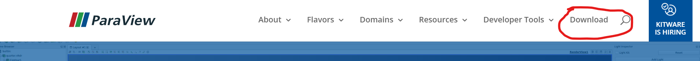

Nightlyではなく、その時点での最新版(本記事執筆時はv5.8)を選ぶと良いだろう。

Windowsの場合は、拡張子がexeで終わっており、かつMPI版ではないもの(本記事執筆時では`ParaView-5.8.0-Windows-Python3.7-msvc2015-64bit.exe`)を選ぶ。


Macの場合は、パッケージ版(拡張子がpkg)を選ぶと良いであろう。

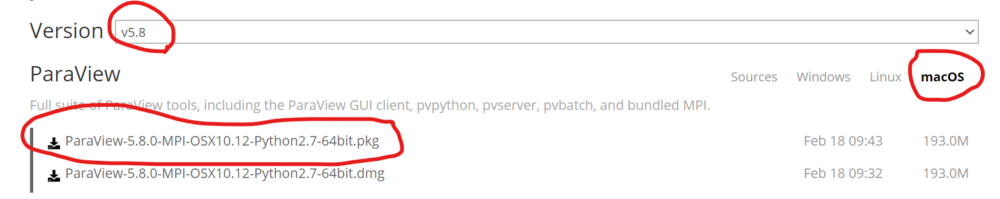

直接インストーラで起動すると怒られる場合があるが、パッケージファイルを右クリックして出てきたメニューで「開く」を選べばインストールできるはずである。

インストール後、実行すると、 「Startup Screen」が現れる。不要なら「Don't show tihs window again」にチェックして「Close」すると、次回から現れなくなる。

以上でインストール完了だ。

## VTKファイルの構造

ParaViewは非常に多くの可視化ができる。このParaViewにデータを食わせる方法はいくつかあるが、最も簡単なのはVTKレガシーフォーマット(Visualization Toolkit Simple Legacy Format)を使うことだ。VTKレガシーフォーマットとは、「レガシー」の名前があることからわかるように現在ではXML形式のデータを使うことが推奨されているのだが、構造が非常に単純なのでプログラムから出力しやすい。

以下では、VTKレガシーフォーマットの構造を簡単に解説しよう。フォーマットの仕様は以下から参照できる。

[http://www.vtk.org/VTK/img/file-formats.pdf](http://www.vtk.org/VTK/img/file-formats.pdf)

### ファイルの構造

VTKファイルは、例えばこんな構造をしている。

```txt
# vtk DataFile Version 1.0
test
ASCII
DATASET STRUCTURED_POINTS
DIMENSIONS 21 21 21
ORIGIN 0.0 0.0 0.0
SPACING 1.0 1.0 1.0

POINT_DATA 9261

SCALARS intensity float
LOOKUP_TABLE default
0
0
0
0
(以下データが続く)
```

1. 最初の行はファイルのバージョン情報。大文字小文字は区別し、バージョンをあらわす数字x.x以外の場所はこの通りに記述する必要がある。
2. 次がファイルの名前。最大256文字。適当に書けばよいと思うが、個人的にはファイル名をここに記述している。
3. 次がファイルフォーマット。ASCIIかBINARYを記述する。ここではASCIIフォーマットのみ説明する。
4. 次がデータセットの構造。いくつか種類があるが、本稿では構造格子(Structured Grid)と非構造格子(Unstructured Grid)のみ扱う。
5. 最後がデータセット。点データ(POINT_DATA)とセルデータ(CELL_DATA)がある。

### 構造格子

ファイルの最初の三行がヘッダーで、四行目からデータ構造の記述になる。もっとも簡単なデータ構造は「構造格子(Structured Grid)」だ。

TODO: 続きを書く

## 可視化のサンプル

では、さっそく可視化をしてみよう。まずはサンプル用のリポジトリ`kaityo256/paraview-sample`をクローンする。後でpushするわけではないので、httpsでクローンして良い。

```sh
cd github
git clone https://github.com/kaityo256/paraview-sample.git
```

クローンしたらそのディレクトリに移動しておこう。

```sh
cd paraview-sample
```

### Simple

最初は最も簡単な構造格子(Structured Grid)のボリュームレンダリングをしてみよう。

ディレクトリ`simple`に`simple.py`があるので実行せよ。

```sh
cd simple
python simple.py
```

同じディレクトリに`simple.vtk`ができたはずだ。これをParaViewで開こう。

まずParaViewを起動し、Ctrl+O(もしくはFile→Open)で`simple.vtk`を開く。すると、Pipeline Browserに「simple.vtk」が追加され、目が閉じたアイコンが表示されたはず。この状態で「Properties」の「Apply」をクリックせよ。Pipeline Browserの「simple.vtk」の左にあるアイコンの目が開いたはずだ。

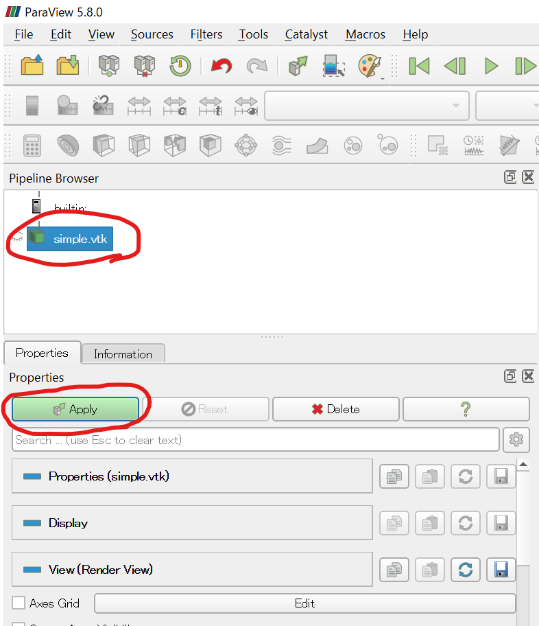

次に、「Outline」となっている表示を「Volume」に変える。最初の実行で「Volumeレンダリングには時間がかかるが良いか？」と聞かれることがあるが、「わかったからもう聞かないで」を選ぶこと。

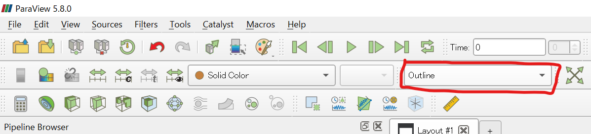

まわりが青く、中心が赤く光る球体が表示されれば成功だ。


次に、カラーマップエディタをいじってみよう。Propertiesの「Coloring」のところにある「Edit」ボタンを押してみよ。

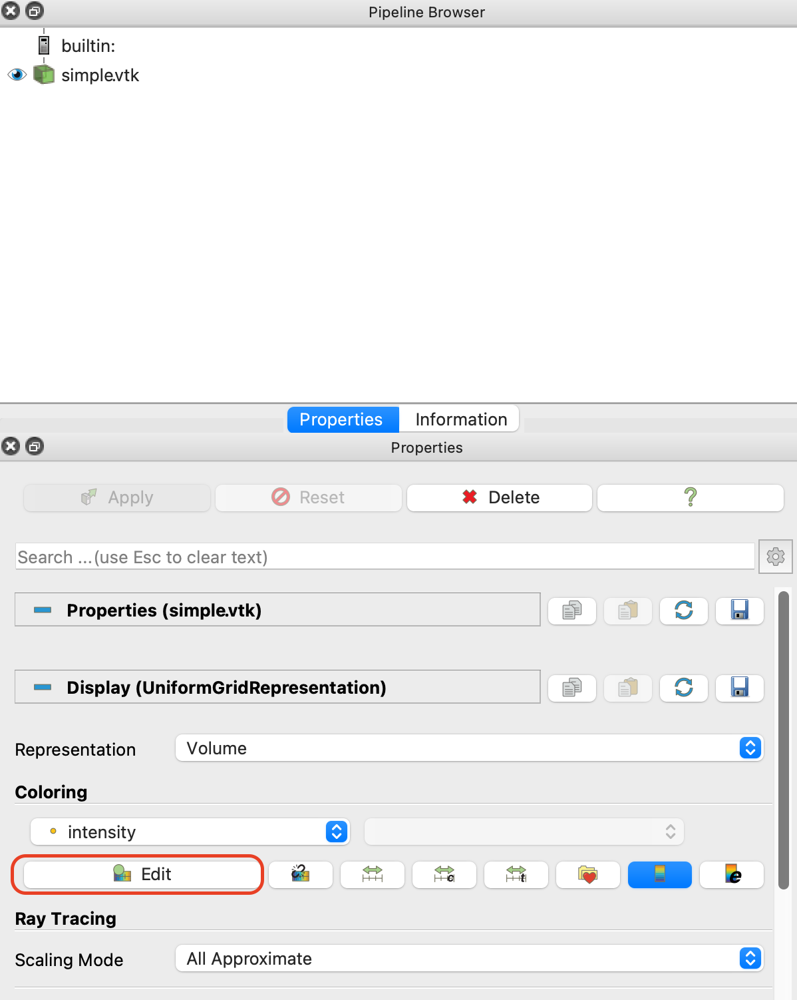

こんな、カラーマップエディタが表示されたはずだ。

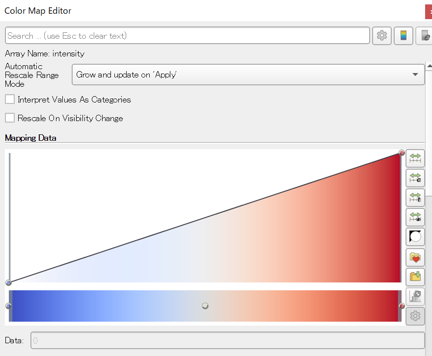

この「Mapping Data」において、値の小さい方が左、値の大きい方が右である。つまり、この状態では「系の一番小さな値」が青く、「系の一番大きな値」が赤く表示されている。また、高さ方向は「濃さ(不透明度)」である。一番上が100%、つまり全く透過せず、一番下が0%、つまり完全透過である。

下のカラーバーの、赤い部分をダブルクリックすると、カラーピッカーが表示される。

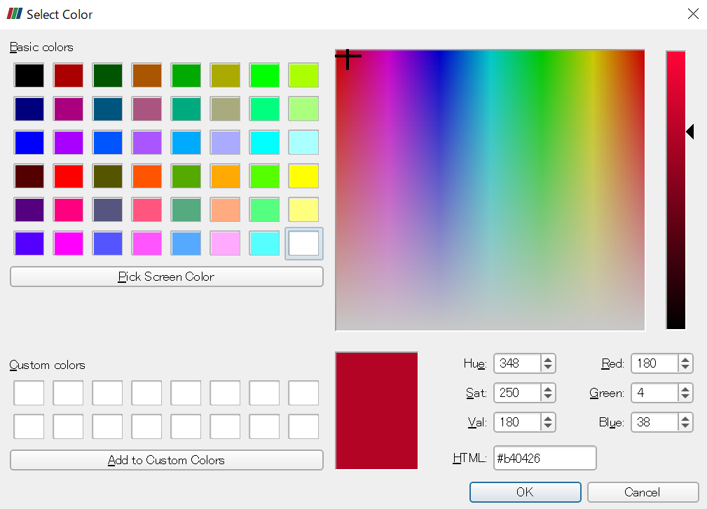

例えばこれで白を選ぶと、一番右が白、すなわち「一番値が大きいところを白く、値が小さいところは青く」表示されることになる。

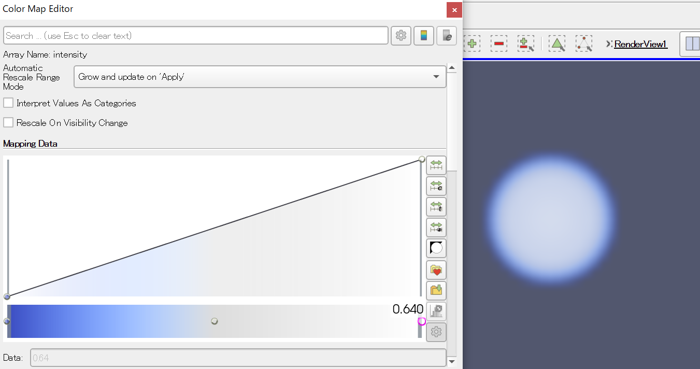

他にも、「ある値の範囲だけ不透明に」などとすることで「膜」を表現できたりと応用ができるので、いろいろ試してみよ。

### 波動関数

先程は、すべて正の値の密度場のボリュームレンダリング、つまり「濃いところ」の可視化のみを行った。次は、正負の値を持つ密度場の可視化の例として、波動関数を可視化してみよう。水素原子の波動関数は、最低エネルギー(1s軌道)以外は「節」を持つ。すなわち、正負の値を取る。この波動関数を密度場として保存する。

なお、カラーマップをいじっていてわけがわからなくなった場合(よくある)は、ParaViewを再起動すると良い。

ディレクトリ`wavefunction`に、`wavefunction.py`があるので実行せよ。

```sh
cd wavefunction
python wavefunction.py
```

すると、以下の三つのファイルが作成される。

* `2pz.vtk`
* `3dz2.vtk`
* `3dzx.vtk`

それぞれ「2pz軌道」「3dz^2軌道」「3dzx軌道」に対応している。これをParaViewで開いて可視化してみよう。まずは`2pz.vtk`を開いてみよう。

先ほどと同様に「2pz.vtk」を「Apply」してから「Volume」を適用すると、以下のような見た目になるはずだ。

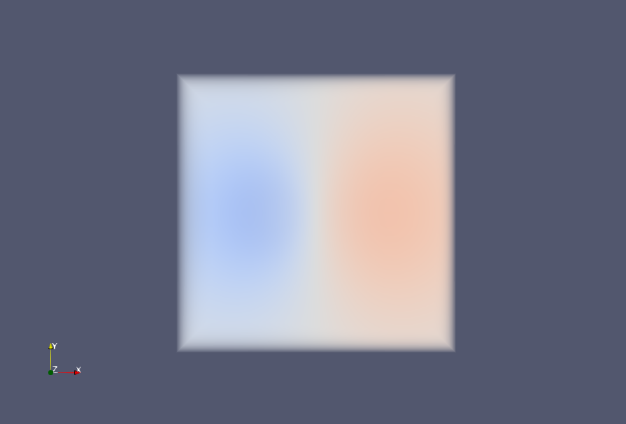

電子の波動関数は、絶対値が電子の存在確率を表し、符号は位相を表すのであった。したがって、絶対値がゼロのところは不透明度0%(完全に透明)にしたい。しかし、デフォルトでは絶対値がゼロのところが不透明度50%になってしまっているため、このような見た目になる。

またColor Map Editorを開いて、以下のような形にしてみよう。

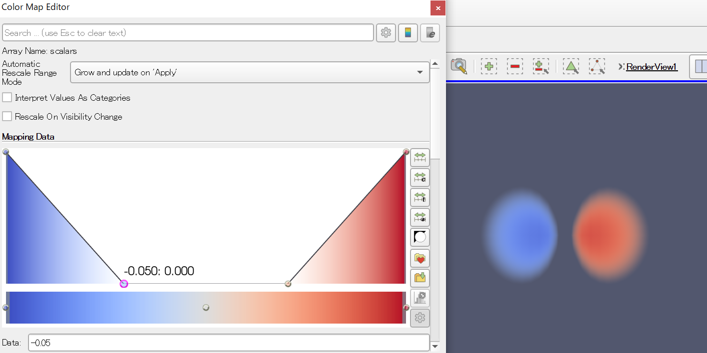

絶対値がゼロ付近の領域を全て透明にして、負符号を持つ領域の不透明度を上げたために、電子の状態が見やすくなったことがわかるだろう。

なお、カラーマップエディターの点をマウスで移動させることもできるが、下の「Data」で数値を直接指定することもできる。ここでは、値「-0.05」から「0.05」までをゼロにしている。

同様に、3d軌道の可視化を試みよ。うまくやれば以下のように可視化できる。

3dz^2軌道

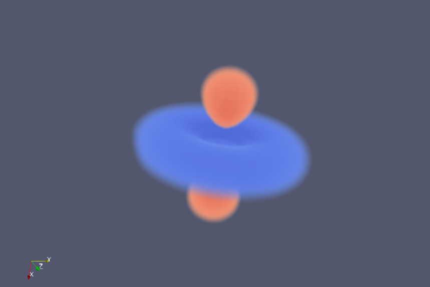

3dzx軌道

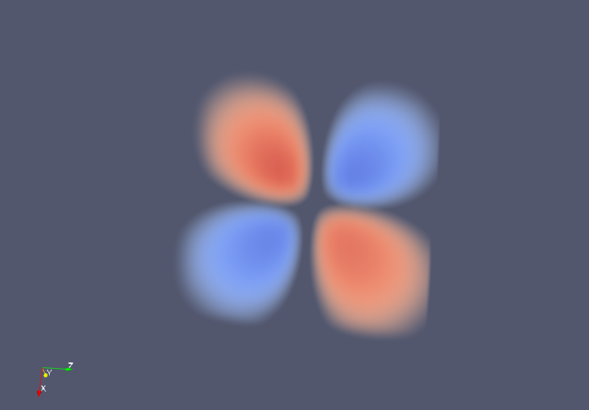

### Glyph

これまではスカラー場を可視化してきた。しかし、速度場など、ベクトル場を可視化したいことがある。そのために「Glyph」という矢印を使った可視化が用意されている。

ディレクトリ`glyph`に、`tgv.py`があるので実行せよ。

```sh
cd glyph
python tgv.py
```

すると、同じディレクトリに`tgv.vtk`が作成されるので、それをParaViewで開いてApplyする。

次に、「Glyph」というフィルタを適用する。デフォルトでアイコンがあるので、それをクリックしてApplyする。

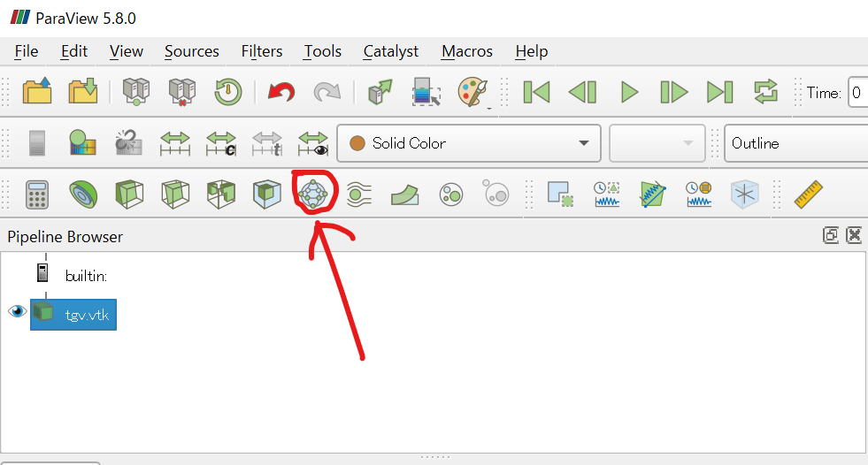

すると、よくわからない表示になったはずだ。そこで、PropertiesのScale Arrayが「angle」になっているのを「velocity」に修正して、もう一度Applyを押す。すると、以下のような表示になったはずだ。

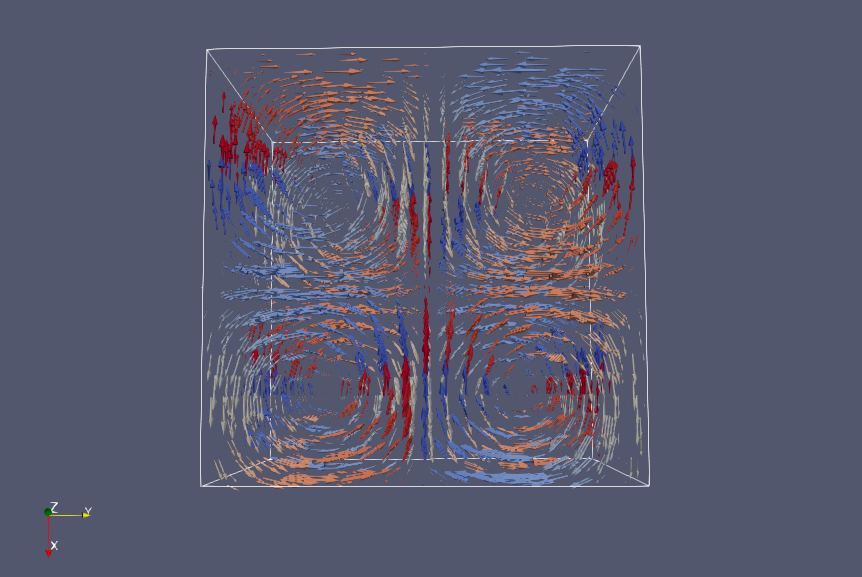

これは「Taylor-Green Vortex」と呼ばれる渦を可視化したものだ。`tgv.vtk`には、各格子点に「速度ベクトル(velocity)」と「角度(angle)」の二つの量が定義されている。前者がベクトル量、後者がスカラー量である。

最初、ParaViewはベクトル場として`velocity`を、その大きさ(scale)としてスカラー量である`angle`を使ったため、矢印の大きさが角度に依存して表示された。しかし、これは速度場なので、ベクトルの大きさは速度の絶対値に比例して欲しい。そこでスケールを角度から速度場に変更することでこのような表示を得た。

また、矢印の「色」は角度でつけている。これはColoringのところに「angle」とあることかわかるだろう。波動関数の場合と同様、カラーマップを修正できるので、いろいろ遊んでみると良い。

### Gray-Scott


