# ParaViewの使い方

VMDは原子や粒子、すなわち「つぶつぶ」を可視化するためのツールだ。しかし、粒子数が増えてくると、全ての粒子を可視化するのは現実的ではない。そこで、空間を小さなセルに区切って「場の量」にすることが多い。「場の量」とは、温度や密度、速度場といったスカラー量、ベクトル量を、位置の関数として表現することだ。以下では、そんな「場の量」を可視化するParaViewというソフトウェアを使ってみよう。

## インストール

[https://www.paraview.org/](https://www.paraview.org/)に行き、「Download」をクリックする。

Nightlyではなく、その時点での最新版(本記事執筆時はv5.12)を選ぶと良いだろう。

Windowsの場合は、拡張子がmsiで終わっており、かつMPI版ではないもの(本記事執筆時では`ParaView-5.12.1-Windows-Python3.10-msvc2017-AMD64.msi`)を選ぶ。


Macの場合は、パッケージ版(拡張子がpkg)を選ぶと良いであろう。「このMacについて」を確認し、自分のMacのプロセッサがIntelである場合はx86版を、M1/M2等である場合はarm64版をダウンロードすること。


パッケージファイルをダブルクリックすればインストールできる。

インストール後、実行すると、 「Startup Screen」が現れる。不要なら「Don't show tihs window again」にチェックして「Close」すると、次回から現れなくなる。

以上でインストール完了だ。

## FFmpegとImageMagickのインストール

ParaViewを扱うのに必須ではないが、動画を作成するのにFFmpegとImageMagickがあると便利だ。事前にインストールしておくと良い。

Windows(WSL)の場合。

```sh
sudo apt install ffmpeg
sudo apt install imagemagick
```

Macの場合。

```sh
brew install ffmpeg
brew install imagemagick
```

## VTKファイルの構造

ParaViewは非常に多くの可視化ができる。このParaViewにデータを食わせる方法はいくつかあるが、最も簡単なのはVTKレガシーフォーマット(Visualization Toolkit Simple Legacy Format)を使うことだ。VTKレガシーフォーマットとは、「レガシー」の名前があることからわかるように現在ではXML形式のデータを使うことが推奨されているのだが、構造が非常に単純なのでプログラムから出力しやすい。

以下では、VTKレガシーフォーマットの構造を簡単に解説しよう。フォーマットの仕様は以下から参照できる。

[http://www.vtk.org/VTK/img/file-formats.pdf](http://www.vtk.org/VTK/img/file-formats.pdf)

### ファイルの構造

VTKファイルは、例えばこんな構造をしている。

```txt
# vtk DataFile Version 1.0
test
ASCII
DATASET STRUCTURED_POINTS
DIMENSIONS 21 21 21
ORIGIN 0.0 0.0 0.0
SPACING 1.0 1.0 1.0

POINT_DATA 9261

SCALARS intensity float
LOOKUP_TABLE default
0
0
0
0
(以下データが続く)
```

1. 最初の行はファイルのバージョン情報。大文字小文字は区別し、バージョンをあらわす数字x.x以外の場所はこの通りに記述する必要がある。
2. 次がファイルの名前。最大256文字。適当に書けばよいと思うが、個人的にはファイル名をここに記述している。
3. 次がファイルフォーマット。ASCIIかBINARYを記述する。ここではASCIIフォーマットのみ説明する。
4. 次がデータセットの構造。いくつか種類があるが、本稿では構造格子(Structured Grid)と非構造格子(Unstructured Grid)のみ扱う。
5. 最後がデータセット。点データ(POINT_DATA)とセルデータ(CELL_DATA)がある。

### 構造格子

ファイルの最初の三行がヘッダーで、四行目からデータ構造の記述になる。もっとも簡単なデータ構造は「構造格子(Structured Grid)」だ。構造格子の定義は以下のようなフォーマットになる。

```txt
DATASET STRUCTURED_POINTS
DIMENSIONS 21 21 21
ORIGIN 0.0 0.0 0.0
SPACING 1.0 1.0 1.0
```

1. 最初の行がデータセット(DATASET)の構造を指定する。ここでは構造格子(STRUCTURED_POINTS)を指定している。
1. 次の行は、三次元直方体の三辺の点の数を与える。ここでは21×21×21の立方体構造を与えている。
1. ORIGINは、原点の座標を指定する。
1. SPACINGは、ひとつのグリッド(直方体形状)のサイズ。いわゆるアスペクト比で、昔はASPECT_RATIOと書いたが、今は非推奨。

これで三次元空間上に21×21×21=9261点の格子点が定義された。

### 非構造格子

構造格子の場合は「直方体の三辺の要素数」及び「単位直方体のサイズ(SPACING)」を指定すればそれで格子点が定義できた。しかし、分子動力学法の結果の可視化や、物体表面の可視化など、非構造格子を使いたい場合もあるだろう。その場合は非構造格子(Unstructured grid)を用いる。

非構造格子の定義は以下のようにする。

```txt
DATASET UNSTRUCTURED_GRID
POINTS NumberOfPoints
x1 y1 z1
x2 y2 z2
x3 y3 z3
...
```

データセットは非構造格子(UNSTRUCTURED_GRID)であり、何点あるかを指定した後は、ベクトル場と同様に(x,y,z)座標をずらずら並べるだけで良い。

### データセット

格子が定義されたら、それぞれの格子上に定義される物理量を指定する。フォーマットはこんな感じになる。

```txt
POINT_DATA 9261

SCALARS intensity float
LOOKUP_TABLE default
0
0
0
0
....
```

1. 最初に、これは点上に定義されたデータだと宣言する(POINT_DATA)。データ数もここで教える。
1. 次からデータセット。いくつか種類があるが、本稿では主にスカラー量(SCALARS)とベクトル量(VECTORS)を扱う。
1. データセットは、「種類 名前 型」を指定する。この例ではスカラー場を定義している。最初の大文字の「SCALARS」は種類。次の「intensity」はデータの名前。自分でわかりやすいような名前をつければよい。最後が型。ここでは浮動小数点数「float」を指定している。
1. 最後にデータの数だけデータをずらずら並べればよい。

なお、データセットは複数定義できる。その場合はParaView側でどのデータをどのような可視化に用いるか選ぶことができる。その際、ここで定義した名前が参照されるので、後で自分がわかりやすいように名前を付けておくこと。

### スカラー場

スカラーの場合は、データを一つずつ並べるだけだ。

```txt
SCALARS intensity float
LOOKUP_TABLE default
0
0
0
0
....
```

スカラー場の場合はルックアップテーブルを指定する必要があるが、ここで詳細には触れない。「おまじない」として記述しておくこと。

### ベクトル場

ベクトル場の場合、単純にデータを3つずつ並べれば良い。ベクトル場ではルックアップテーブルは不要だ。データフォーマットはこんな感じになる。

```txt
VECTORS velocity float
x1 y1 z1
x2 y2 z2
x3 y3 z3
...
```

### 複数のデータセット

ベクトル場を可視化する場合、単純に矢印だけ表示しても見づらいことが多い。そこで、各格子点に可視化補助用のスカラー量も定義しておくと良い。スカラー場とベクトル場は単純に並べてかける。

```txt
VECTORS nameofvector float
x1 y1 z1
x2 y2 z2
x3 y3 z3
...


SCALARS nameofscalar float
LOOKUP_TABLE default
s1
s2
s3
...
```

以下のサンプルでは、ベクトルの角度や、z座標をスカラー場として定義しておき、矢印のカラーリングに使っている。

## 可視化のサンプル

では、さっそく可視化をしてみよう。まずはサンプル用のリポジトリ`kaityo256/paraview-sample`をクローンする。後でpushするわけではないので、httpsでクローンして良い。

```sh
cd github
git clone https://github.com/kaityo256/paraview-sample.git
```

クローンしたらそのディレクトリに移動しておこう。

```sh
cd paraview-sample
```

### 構造格子におけるボリュームレンダリング

最初は最も簡単な構造格子(Structured Grid)のボリュームレンダリングをしてみよう。

ディレクトリ`simple`に`simple.py`があるので実行せよ。

```sh
cd simple
python3 simple.py
```

同じディレクトリに`simple.vtk`ができたはずだ。これをParaViewで開こう。

まずParaViewを起動し、Ctrl+O(もしくはFile→Open)で`simple.vtk`を開く。すると、Pipeline Browserに「simple.vtk」が追加され、目が閉じたアイコンが表示されたはず。この状態で「Properties」の「Apply」をクリックせよ。Pipeline Browserの「simple.vtk」の左にあるアイコンの目が開いたはずだ。


なお、WSLを使っている場合は、ファイルを開くのに工夫が必要だ。まず、ParaViewの「Open File」ウィンドウが開いたら、File nameのところに「\\wsl.localhost」と入力し、「Navigate」ボタンを押す。すると「Ubuntu」というファイルが見つかるため、そこから「home」「ユーザ名」「github」「paraview-sample」「simple」とディレクトリを移動すれば良い。

次に、「Outline」となっている表示を「Volume」に変える。最初の実行で「Volumeレンダリングには時間がかかるが良いか？」と聞かれることがあるが、「わかったからもう聞かないで」を選ぶこと。


まわりが青く、中心が赤く光る球体が表示されれば成功だ。


次に、カラーマップエディタをいじってみよう。Propertiesの「Coloring」のところにある「Edit」ボタンを押してみよ。


こんな、カラーマップエディタが表示されたはずだ。


この「Mapping Data」において、値の小さい方が左、値の大きい方が右である。つまり、この状態では「系の一番小さな値」が青く、「系の一番大きな値」が赤く表示されている。また、高さ方向は「濃さ(不透明度)」である。一番上が100%、つまり全く透過せず、一番下が0%、つまり完全透過である。

下のカラーバーの、赤い部分を選んでからエンターキーを押すと、カラーピッカーが表示される。


例えばこれで白を選ぶと、一番右が白、すなわち「一番値が大きいところを白く、値が小さいところは青く」表示されることになる。


他にも、「ある値の範囲だけ不透明に」などとすることで「膜」を表現できたりと応用ができるので、いろいろ試してみよ。

### 波動関数

先程は、すべて正の値の密度場のボリュームレンダリング、つまり「濃いところ」の可視化のみを行った。次は、正負の値を持つ密度場の可視化の例として、波動関数を可視化してみよう。水素原子の波動関数は、最低エネルギー(1s軌道)以外は「節」を持つ。すなわち、正負の値を取る。この波動関数を密度場として保存する。

なお、カラーマップをいじっていてわけがわからなくなった場合(よくある)は、ParaViewを再起動すると良い。

ディレクトリ`wavefunction`に、`wavefunction.py`があるので実行せよ。カレントディレクトリが`simple`の場合は、一度`cd ..`を実行して上のディレクトリに移動しておくこと。

```sh
cd wavefunction
python3wavefunction.py
```

すると、以下の三つのファイルが作成される。

* `2pz.vtk`
* `3dz2.vtk`
* `3dzx.vtk`

それぞれ「2pz軌道」「3dz^2軌道」「3dzx軌道」に対応している。これをParaViewで開いて可視化してみよう。まずは`2pz.vtk`を開いてみよう。

先ほどと同様に「2pz.vtk」を「Apply」してから「Volume」を適用すると、以下のような見た目になるはずだ。


電子の波動関数は、絶対値が電子の存在確率を表し、符号は位相を表すのであった。したがって、絶対値がゼロのところは不透明度0%(完全に透明)にしたい。しかし、デフォルトでは絶対値がゼロのところが不透明度50%になってしまっているため、このような見た目になる。

またColor Map Editorを開いて、以下のような形にしてみよう。


絶対値がゼロ付近の領域を全て透明にして、負符号を持つ領域の不透明度を上げたために、電子の状態が見やすくなったことがわかるだろう。

なお、カラーマップエディターの点をマウスで移動させることもできるが、下の「Data」で数値を直接指定することもできる。ここでは、値「-0.05」から「0.05」までをゼロにしている。

同様に、3d軌道の可視化を試みよ。うまくやれば以下のように可視化できる。

3dz^2軌道


3dzx軌道


### Glyphによるベクトル場の可視化

これまではスカラー場を可視化してきた。しかし、速度場など、ベクトル場を可視化したいことがある。そのために「Glyph」という矢印を使った可視化が用意されている。

ディレクトリ`glyph`に、`tgv.py`があるので実行せよ。

```sh
cd glyph
python3tgv.py
```

すると、同じディレクトリに`tgv.vtk`が作成されるので、それをParaViewで開いてApplyする。

次に、「Glyph」というフィルタを適用する。デフォルトでアイコンがあるので、それをクリックしてApplyする。


すると、よくわからない表示になったはずだ。そこで、PropertiesのScale Arrayが「angle」になっているのを「velocity」に修正して、もう一度Applyを押す。

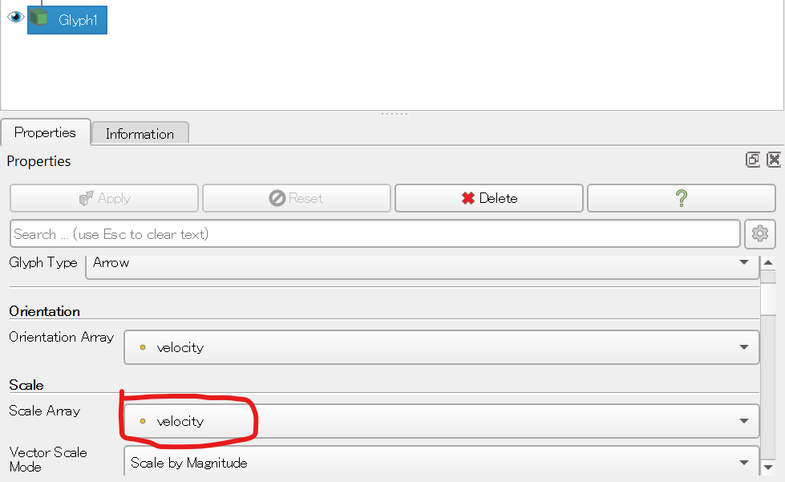

すると、以下のような表示になったはずだ。


これは「Taylor-Green Vortex」と呼ばれる渦を可視化したものだ。`tgv.vtk`には、各格子点に「速度ベクトル(velocity)」と「角度(angle)」の二つの量が定義されている。前者がベクトル量、後者がスカラー量である。

最初、ParaViewはベクトル場として`velocity`を、その大きさ(scale)としてスカラー量である`angle`を使ったため、矢印の大きさが角度に依存して表示された。しかし、これは速度場なので、ベクトルの大きさは速度の絶対値に比例して欲しい。そこでスケールを角度から速度場に変更することでこのような表示を得た。

また、矢印の「色」は角度でつけている。これはColoringのところに「angle」とあることかわかるだろう。波動関数の場合と同様、カラーマップを修正できるので、いろいろ遊んでみると良い。

このように、VTKファイルでは、同じ点に複数の物理量を定義できる。詳細は仕様を参照のこと。

### 非構造格子上のベクトル場の可視化

これまでは、系に規則的な格子が存在し、そこに物理量が定義されていた。次は非構造格子(Unstructured Grid)の可視化を試してみよう。

ディレクトリ`unstructured`に`sphere.py`があるので実行せよ。

```sh
cd unstructured
python3 sphere.py
```

同じディレクトリに`sphere.vtk`ができるので、ParaViewで開いてApplyせよ。

その後、また「Glyph」フィルターを適用せよ。以下のような表示が得られるはずだ。

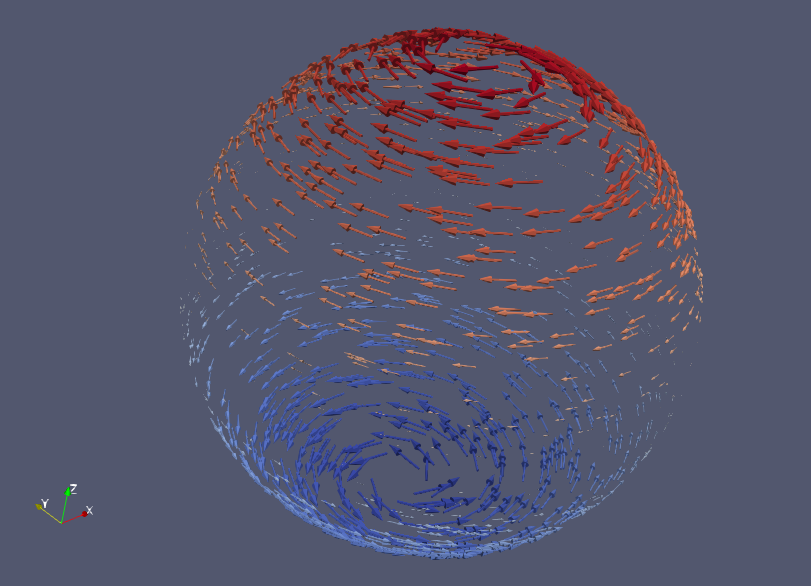

このデータは、まず球面上にランダムに点を生成し、それを「非構造格子点」としている。そして、それぞれの点に、ベクトル場とスカラー場を定義している。ベクトル場は球の自転方向の向きで、大きさと色はz座標を利用している。このVTKファイルを出力するコード(`sphere.py`)は46行と短いので、興味があれば内容を見てみよ。

### Gray-Scott模型

最後にシミュレーション結果をアニメーションとして可視化してみよう。シミュレーションするのはGray-Scott模型と呼ばれる、反応拡散方程式の一種である。Gray-Scottモデルは、活性化因子と抑制因子の二種類が、お互いに反応しながら拡散する様子をモデル化したものだ。

ディレクトリ`gray-scott`に`gs.py`があるので実行せよ。

```sh
cd gray-scott
python3 gs.py
```

なお、`matplotlib`モジュールが無い、`numba`モジュールが無いなどと文句を言われたら`pip`で入れること。

```sh
python3 -m pip install matplotlib numba
```

実行すると、`conf000.vtk`から`conf119.vtk`までの120個のファイルが作成される。これをParaViewで開こう。

ParaViewでは、連番のファイルは`conf..vtk`のように`..`で表示され、まとめて読み込むことができる。

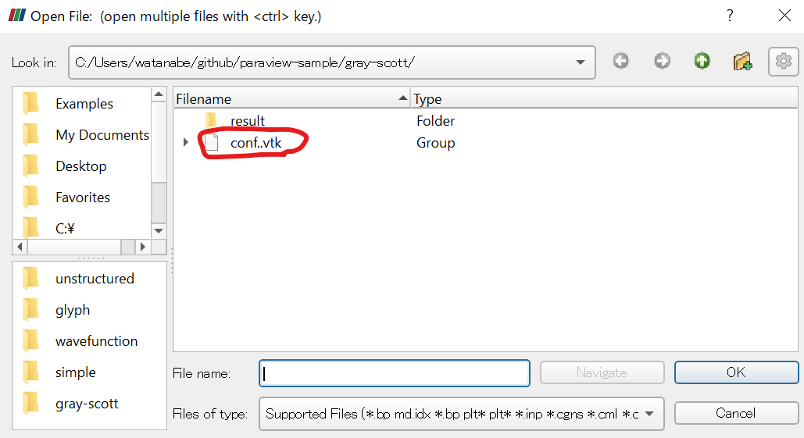

Applyしたら、まずは「最後のフレーム」ボタンを押そう。

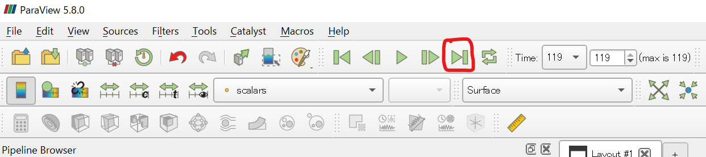

不思議な白っぽい模様が現れたはずだ。その状態で、PropertiesのColoringにある「Rescale to Data Range」ボタンを押す。

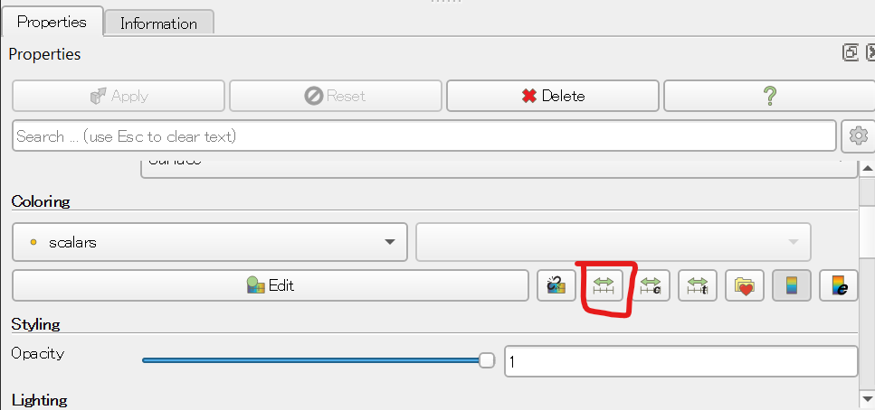

これにより、白っぽかった画像が赤っぽくなったはずだ。これは、データの範囲を、一番最後のフレームに合わせる、という意味だ。最初のフレームの振幅が大きいため、それに合わせると以降のフレームで変化がわかりにくい。

さて、このままでも可視化はできているのだが、もう少し加工して見やすくしよう。

まずは「Delaunay 2D」フィルタを適用する。Filtersメニューから探しても良いが、ParaViewには大量のフィルタがあって探すのが大変なので、検索することにしよう。「Filters」メニューから「Search」を選ぼう。検索ウィンドウが表示されるので「de」まで入力する。

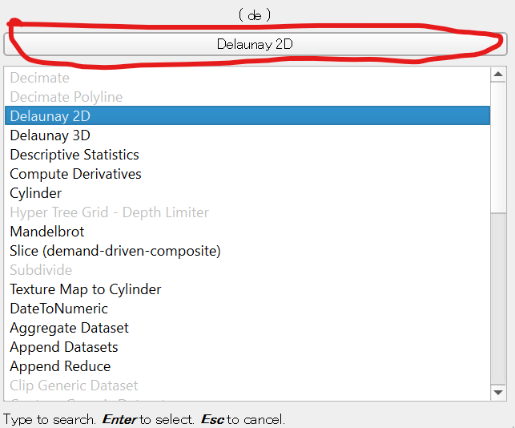

すると、上のボタンに「Delaunay 2D」が候補として現れるので、そのボタンを押してApplyする。すると、以下のように画像が鮮やかになったはずだ。

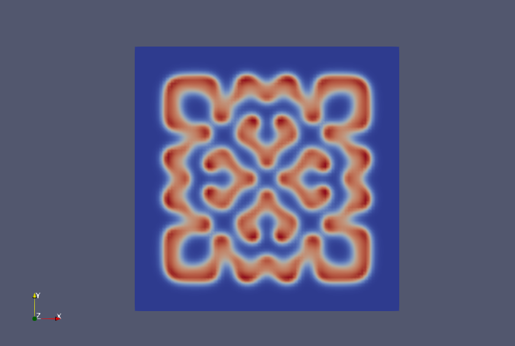

さらに、この画像を三次元的に盛り上げよう。「Filter」→「Search」から、今度は「Warp by Scalar」を選ぶ。「wa」と入力すれば候補として現れるはずだ。

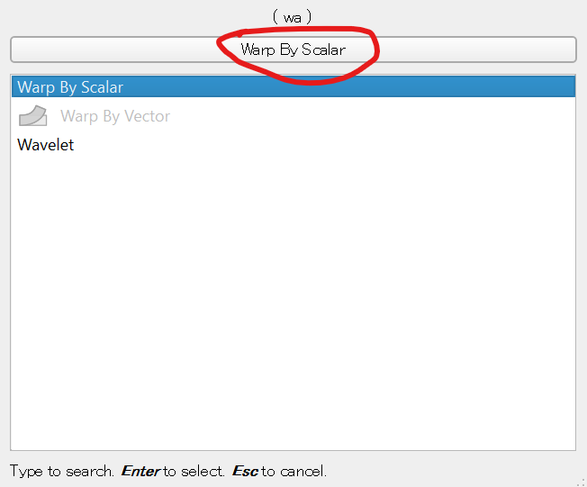

これを選んだ後、PropertiesのScale Factorを10に修正してからApplyを押す。これは、デフォルトの1では値が小さすぎて盛り上がりがよく見えないためだ。

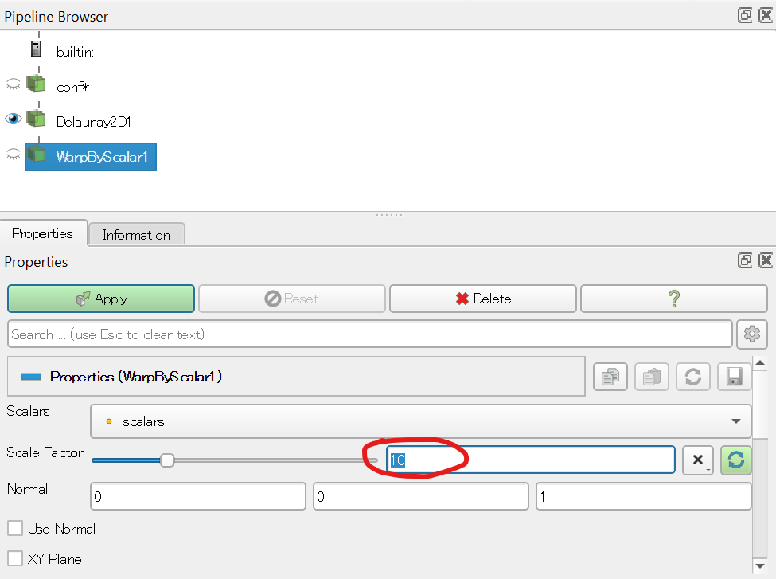

以下のように盛り上がった画像が得られたら、2Dと書かれたボタンを押して3D表示に変える。

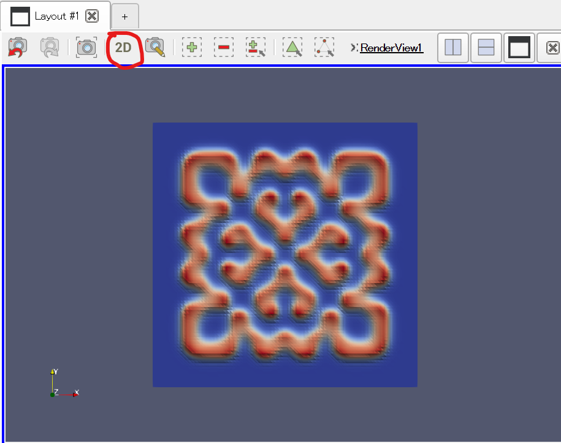

3D表示にした瞬間、画像が小さくなりすぎてしまうことがある。その場合は「-Z」ボタンを押すと復帰できる。

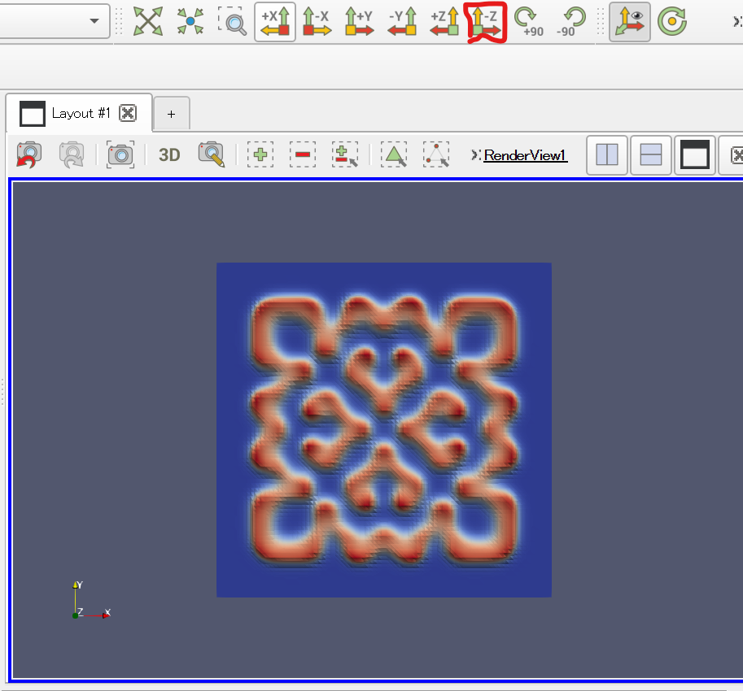

あとは適当にマウスでぐりぐりして、よさそうなアングルを見つけたら、「再生」ボタンを押そう。

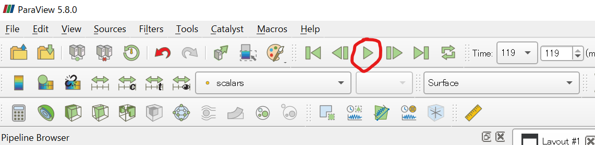

アニメーションが表示されるはずだ。

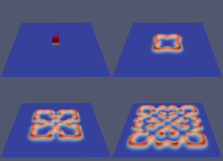

アニメーションとして保存したい場合は、「File」→「Save Animation」から連番PNGを出力し、ImageMagickでアニメーションGIFにするなり、FFmpegでmp4にするなりできる。参考のためにコマンドだけ書いておく。インストール方法などは各自調べること。以下は`gs.0000.png`などという形で連番で出力した場合だ。

ImageMagickを使ってアニメーションGiFを作る場合。

```sh
convert -delay 5 -loop 0 -resize 50% gs.*.png gs.gif
```

FFmpegでmp4ファイルを作る場合。

```sh
ffmpeg -i gs.%04d.png  -pix_fmt yuv420p gs.mp4
```

なお、「幅が2の倍数ではない」などと怒られたら、`mogrify`を使ってリサイズすると良い。

```sh
mogrify -resize 860x616! *.png
```

最後の`!`は上書き保存という意味だ。
