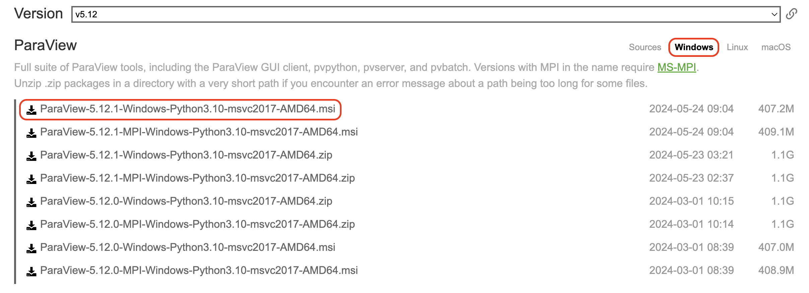

# ParaViewの使い方

VMDは原子や粒子、すなわち「つぶつぶ」を可視化するためのツールだ。しかし、粒子数が増えてくると、全ての粒子を可視化するのは現実的ではない。そこで、空間を小さなセルに区切って「場の量」にすることが多い。「場の量」とは、温度や密度、速度場といったスカラー量、ベクトル量を、位置の関数として表現することだ。以下では、そんな「場の量」を可視化するParaViewというソフトウェアを使ってみよう。

## インストール

[https://www.paraview.org/](https://www.paraview.org/)に行き、「Download」をクリックする。

Nightlyではなく、その時点での最新版(本記事執筆時はv5.8)を選ぶと良いだろう。

Windowsの場合は、拡張子がexeで終わっており、かつMPI版ではないもの(本記事執筆時では`ParaView-5.8.0-Windows-Python3.7-msvc2015-64bit.exe`)を選ぶ。

Macの場合は、パッケージ版(拡張子がpkg)を選ぶと良いであろう。

直接インストーラで起動すると怒られる場合があるが、パッケージファイルをダブルクリックすればインストールできるはずである。
