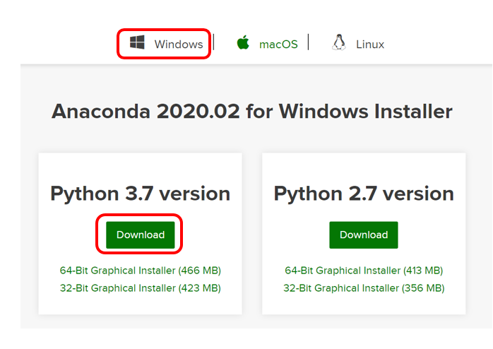
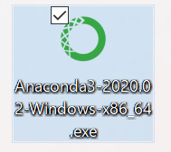
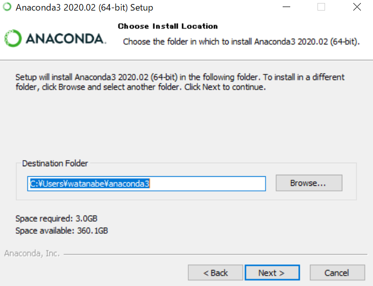

# Pytyhonのインストール

PCにPythonをインストールし、VSCodeから実行できるようにする。MacはデフォルトでPythonがインストールされているが、バージョンが古く、必要なライブラリが入っていないので、新たにインストールする。以下では全く環境をいじっていないpCにPythonのディストリビューションとしてAnacondaを、エディタとしてVSCodeをインストールして使うことを想定しているが、自分でインストールして使っているPythonがあったり、他に好きなエディタがあればそれを使ってかまわない。

## Windows編

### Anacondaのインストール

まず、ログイン名を英語にしておくことを推奨する。もし最初に日本語名でアカウントを作成してしまった場合、新たに英語名のログイン名のアカウントを作成し、そのアカウントに管理者権限を付与して、以降はそのアカウントをメインに使うのが良い。日本語アカウント名のままでもなんとかなるかもしれないが、昔はいろいろ不具合が起きたのでおすすめしない。

最初に、Anacondaをインストールする。ブラウザでAnacondaと検索するか、[https://www.anaconda.com/](https://www.anaconda.com/)にアクセスし、右上にある「Download」ボタンを押す。


ページの下の方に「Windows | macOS | Linux」のタブが現れるので、「Windows」を選択してから「Python 3.7 version」の「Download」ボタンを押す。



ダウンロードが完了したら、管理者権限で実行してインストールを実行する。



何度か設定について聞かれるが、全てデフォルトのままで良い。

途中で、インストール先を聞かれる。



これもデフォルトで良いが、アカウントを英語名にしておかないと、インストール先に日本語が含まれて、後で面倒なことになるかもしれない。インストールが完了したら、Finishを押す。

### Jupyter Notebookのテスト

Windowsのスタートメニューから、Anaconda Navigatorを実行する。Windows 10だとメニューが折り畳まれている場合もあるので注意。


起動すると必要なパッケージを自動でインストールするため、環境によっては初回起動時に時間がかかるかもしれない。

Navigatorが起動したら、Jupyter Notebookを実行する。以下の画面の「Jupyter Notebook」の下の「Launch」をクリックする。


デフォルトのブラウザで、Jupyter Notebookが開かれるので、右上の「New」ボタンから「Python 3」を選ぶ。


新しいタブが開き、入力待ちになるので、そこで何かプログラムを入力する。例えば

```py
print("Hello Python")
```

と入力し「Shift+Return」もしくは上の「Run」ボタンをクリックする。


セルの真下に「Hello Python」と表示されて、次のセルが入力待ちになれば成功である。これでPythonを実行する環境は整った。

右上の「Quit」を押してサーバを終了する。「Logout」を押して終了しようとすると、Anaconda Navigatorを終了しようとする時に
「Jupyter Notebookが終了していない」と言われるの注意。その場合はそのまま終了して問題ない。

また、次回からはAnaconda Navigatorを経由せず、いきなりJupyter Notebookを実行して良い。「Jupyter Notebook」というタイトルの
コマンドライン画面経由でブラウザが起動されるが、「Quit」を押せば、コマンドライン画面は消える。この時も「Logout」を押すと
コマンドライン画面が残ってしまうが、その場合はCtrl+Cを何度か押せば消える。

### Anacondaのトラブル

たまに、Anaconda Navigatorを終了しようとすると「Anaconda Navigator is still busy. Do you want to quit?」と言われることがある。しばらくまって、再度終了しようとしてもまた出る場合はそのまま終了して良い。
