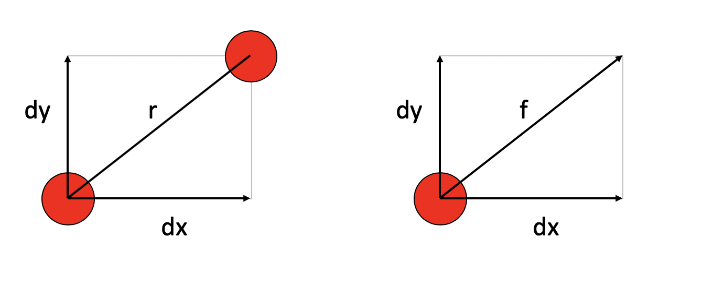
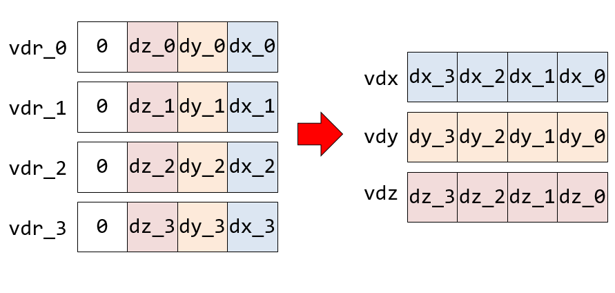
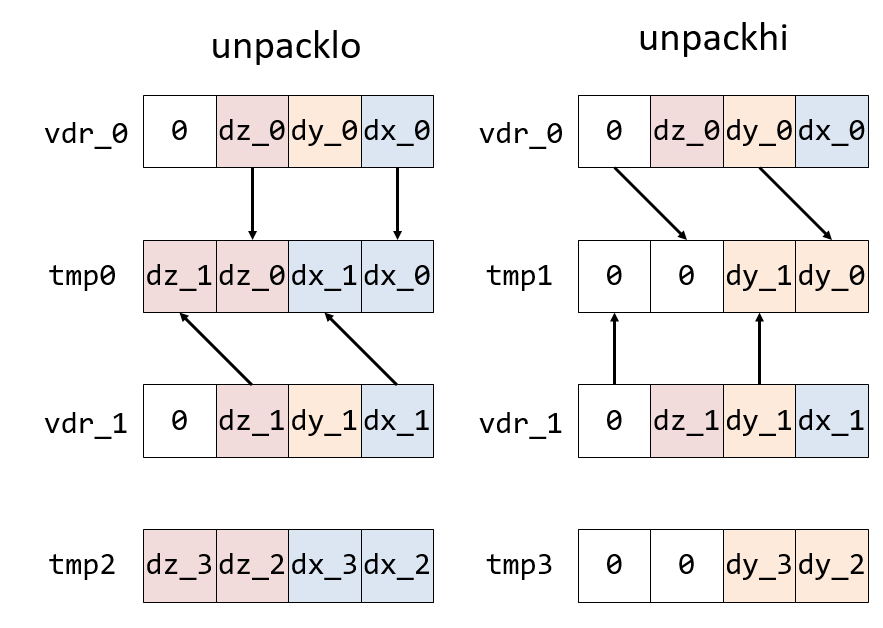
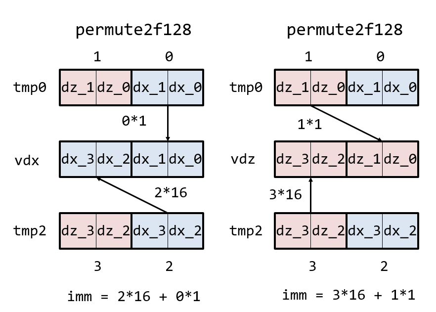

# 簡単なSIMD化

Lennard-Jonesポテンシャルの力の計算を題材に、Intel AVX2命令セットを用いたSIMD化を体験してみる。

## 参考文献

SIMD化については、以下を参考にすること。

* [LJの力計算のSIMD化ステップ・バイ・ステップ その0](https://qiita.com/kaityo256/items/5be3ce71a6ff9522a0e6)
* [一週間でなれる！スパコンプログラマ day7](https://kaityo256.github.io/sevendayshpc/day7/index.html)

## 分子動力学法の基礎

まず、SIMD化をする前に、全体のシミュレーションのどこを最適化しようとしているのかを理解しよう。

分子動力学法は、粒子間に働く力を計算し、その力にもとづいて運動量を変化させ、その運動量の変化を考慮してまた力を計算し・・・という処理を繰り返すことで粒子を動かすシミュレーション方法だ。シミュレーションは、以下のようなステップで実行される。

1. 初期条件を作る(粒子の初期位置と初期速度を与える)
2. 粒子間距離からお互いにかかる力を計算する
3. 力から力積を計算し、運動量を更新する
4. 運動量から座標を更新する
5. ステップ2へ戻る

その他、状況に応じて温度制御をしたり、物理量の測定をしたりするが、上記のステップのうちもっとも計算が重い場所(ホットスポットと呼ぶ)は力の計算で、計算時間の9割以上を占める場合が多い。したがって、そこを高速化すると全体の計算時間も高速化される。逆に、ホットスポットではない場所を高速化しても計算速度向上には貢献しない。

以下では、「力の計算(と、運動量の更新)」のみを切り出したコードについてSIMD化を試みる。

## Lennard-Jonesポテンシャルの力計算について

二体の等方ポテンシャルを考える。これは、二つの粒子間に働く力が、お互いの距離$r$だけで決まるモデルだ。まず、二つの粒子が距離$r$だけ離れた場所にいるときのポテンシャルエネルギー$V(r)$を考える。粒子間に働く力は、その$r$に関する微分に負符号をつけたもの、すなわち$f(r) = -V'(r)$だ。

シミュレーションでは三次元空間を考えるが、以下では簡単のために二次元を考えよう。二つの粒子の粒子番号をiとjとする。慣例により、それぞれi粒子、j粒子と呼ぼう。i粒子の座標を$(q^i_x, q^i_y)$、j粒子の座標を$(q^j_x, q^j_y)$とする。i粒子から見たj粒子の相対座標ベクトルは

$$
\vec{r} = (dx, dy) = (q^j_x - q^i_x, q^j_y - q^i_y)
$$

となる。相対距離$r$は

$$
r = |r| = \sqrt{dx^2 + dy^2}
$$

であるが、計算では$r^2$のまま扱うことが多い。

さて、Lennard-Jonesポテンシャルは以下のような関数だ。

$$
V(r) = 4 \left(r^{-12} - r^{-6} \right)
$$

ただし、簡単のためにエネルギースケール$\varepsilon$や粒子直径$\sigma$は1としている。

力は$f(r) = -V'(r)$であるから、

$$
f(r) = \frac{48}{r^{13}} - \frac{24}{r^7}
$$

さて、この力は「i粒子から見てj粒子から受ける力」を表しており、例えば引力なら$j$粒子の方向へ引っ張られており、斥力なら遠ざかる方向に押されれている。すなわちベクトル量である。x方向に受ける力を $f_x$とすると、

$$
f_x = f \times \frac{dx}{r}
$$

である。



この力が時間$dt$だけ継続した場合、x方向に受ける力積$I_x$は

$$
I_x = f_x dt
$$

である。以上から

$$
I_x = f \times \frac{dx}{r} \times dt
$$

となる。ここで、

$$
df \equiv f \times \frac{dt}{r}
$$

とすると、

$$
df = \left(\frac{48}{r^{14}} - \frac{24}{r^8} \right)
$$

となり、$r^2$だけで計算できる量となる(平方根の計算が不要になる)。時間$dt$の間に受ける力積$I_x$は

$$
I_x = df \times dx
$$

であり、i粒子の運動量 $p_x^i$は、時間刻み$dt$の間に

$$
p_x^i = p_x^i + df \times dx
$$

という変化を受ける。これが時間刻み$dt$の間に$i$粒子が$j$粒子より受ける力積である。作用反作用の法則から、$j$粒子の運動量は

$$
p_j^i = p_j^i - df \times dx
$$

と変化を受ける。この計算を$y$座標や$z$座標についても行えば、ある$i$粒子と$j$粒子のペアに対する力の計算と運動量の更新は完了である。これをすべてのペアについて行えば、運動量の更新の1ステップが完了する。

なお、

$$
df = \left(\frac{48}{r^{14}} - \frac{24}{r^8} \right)
$$

は、計算回数をへらすために項をまとめて

$$
df = \frac{48 - 24 r^6}{r^{14}}
$$

と変形しておく。

## SIMD化

### SIMD化練習用コードの使い方

それでは実際にSIMD化をしてみよう。SIMD化の練習のためのリポジトリを用意したので、適当なディレクトリ(例えばgithub)にてそれをcloneしよう。

```sh
cd github
git clone https://github.com/kaityo256/lj_simd_test.git
cd lj_simd_test
```

このリポジトリには`lj.cpp`がある。まずはコンパイルして実行してみよう。`make`すると実行バイナリ`a.out`ができる。

```sh
$ make
$ ./a.out
N=4000, simple   4313 [ms]
N=4000, simd     4329 [ms]
Check OK
```

このプログラムは全く同じ力の計算を、単純なループで計算する関数`calc_force_simple`と、これからSIMD化する関数`calc_force_simd`を100回ずつ実行し、その実行時間を計測しつつ、実行結果が一致することを確認するものだ。両者の実行結果が一致すれば「Check OK」、不一致なら「Check Failed」と表示される。関数calc_force_simdは、一部だけSIMD命令が使われている。この関数を「Check OK」の状態を保ちながらSIMD化していき、最終的に二倍以上の実行速度向上を目指す(つまり、simdの実行時間をsimpleの半分以下とする)のが目標である。

まずはそのまま挑戦してほしいが、慣れていなければかなり難しいと思われる。以下、少しずつヒントを出すので、適宜参照しながら行ってほしい。

### Step1：ループアンローリング

#### ループアンローリングとは

SIMD化においてまず行うことは、ループのアンロール(Loop unrolling)である。AVX2の256ビットレジスタを使ったSIMD化では、倍精度浮動小数点数を4つ同時に計算できる。したがって、4つの独立な計算を作らなければならない。そのための方法がループアンローリングである。

以下のようなループを考えよう。

```cpp
for(int i=0;i<20;i++){
    printf("%d\n",i);
}
```

これは、0から19までの数字を表示するだけのプログラムだ。C言語の`for`文は、ループカウンタの初期化、ループの継続条件、ループカウンタのインクリメントの3つを指定する。ここでは、

* `int i=0` 0からスタートで
* `i<20` i=20になったら終了(つまりi=19まで実行される)
* `i++` ループ一回ごとに iに1を加える

という意味である。

このループを以下のように変形する。

```cpp
for (int i = 0; i < 20; i += 4) {
  printf("%d\n", i);
  printf("%d\n", i + 1);
  printf("%d\n", i + 2);
  printf("%d\n", i + 3);
}
```

実行結果は同じであるが、1ループごとに、ループカウンタが4つずつ増えている。その代わり、ループ内で行う仕事が4倍に増えた。これを4倍のループアンローリングと呼ぶ。アンロールする前と等価な処理をしているが、ループ内に独立な処理が4つ現れたことがわかる。これをまとめていっきにやろう、というのがSIMD化の第一歩である。

#### ループの端数処理

さて、先程は20回のループであったので4で割り切れたが、4で割り切れない場合もある。その場合は「余りのループ」を処理してやらないといけない。例えば、もともと22回のループであったとしよう。

```cpp
for (int i = 0; i < 22; i++) {
  printf("%d\n", i);
}
```

これを4倍にアンロールするには、

```cpp
int i = 0;
for (; i + 4 < 22; i += 4) {
  printf("%d\n", i);
  printf("%d\n", i + 1);
  printf("%d\n", i + 2);
  printf("%d\n", i + 3);
}
for (; i < 22; i++) {
  printf("%d\n", i);
}
```

とする。まず、ループ内でのみ有効であったループカウンタ`i`をループの外に出した。そして、ループの継続条件を `i < 22`から `i + 4 < 22`にした。これで `i+3`が22を超えることはなくなった。

さて、4倍展開されたループが終わった時点で変数 `i`には20が入っている。それは、`i=16`までは `i+4 < 22`が満たされているが、次のループの `i=20`では満たされなくなったためだ。

あとは、そこから最後までもとのループを回せば良い。これをループの端数処理と呼ぶ。ループの端数はSIMD化できないので、SIMD化するのは前のループのみとなる。

#### 多重ループのループアンローリング

しばしばループは多重ループとなる。特に分子動力学法においては、i粒子に関するループと、i粒子と相互作用するj粒子のループの二重ループとなることが多い。例えば以下は二重ループの例である。

```cpp
  const int N = 10;
  for (int i = 0; i < N - 1; i++) {
    for (int j = i + 1; j < N; j++) {
      printf("%d %d\n", i, j);
    }
  }
```

さて、多重ループをSIMD化する場合、外側と内側のループのどちらかをアンロールしてやる必要がある。どちらをアンロール(SIMD化)する方が良いかはコードに依存するが、とりあえず内側をアンロールしてやることにしよう。つまり、以下のようなループを4倍にアンロールする。

```cpp
for (int j = i + 1; j < N; j++) {
  printf("%d %d\n", i, j);
}
```

アンロールのやり方は先程と同様だ。

```cpp
int j = i + 1;
for (; j + 3 < N; j+=4) {
  printf("%d %d\n", i, j);
  printf("%d %d\n", i, j + 1);
  printf("%d %d\n", i, j + 2);
  printf("%d %d\n", i, j + 3);
}

for (; j < N; j++) {
  printf("%d %d\n", i, j);
}
```

#### ステップ1：ループアンロール

関数`calc_force_simd`の内側のループを4倍にアンロールせよ。ただし、アンロール前と結果は一致しなければならない。

後のために、4倍展開した内側のループの冒頭で

```cpp
int j_0 = j;
int j_1 = j + 1;
int j_2 = j + 2;
int j_3 = j + 3;
```

というループカウンタを用意し、それまで `j`を使っていたものを4倍に増やしてからそれぞれ`j_0`,`j_1`, `j_2,`,`j_3`に置換すれば良い。

例えば先程の

```cpp
for (int j = i + 1; j < N; j++) {
  printf("%d %d\n", i, j);
}
```

を4倍展開する例なら、まずはループの端数処理とループカウンタのインクリメントを4倍にする処理を書く。

```cpp
int j = i + 1;
for (; j + 3 < N; j+=4) {
  printf("%d %d\n", i, j);
}

for (; j < N; j++) {
  printf("%d %d\n", i, j);
}
```

このままでは、4倍展開したループ内の処理が足りないので増やすのだが、まずループカウンタを4つに増やす。

```cpp
int j_0 = j;
int j_1 = j + 1;
int j_2 = j + 2;
int j_3 = j + 3;
```

次に、ループ内の処理を4倍に増やす。

```cpp
  printf("%d %d\n", i, j);
  printf("%d %d\n", i, j);
  printf("%d %d\n", i, j);
  printf("%d %d\n", i, j);
```

最後に、`j`を先程増やしたループカンタに変える。

```cpp
  printf("%d %d\n", i, j_0);
  printf("%d %d\n", i, j_1);
  printf("%d %d\n", i, j_2);
  printf("%d %d\n", i, j_3);
```

アンロールされたループ内では、生のループカウンタ`j`が残っていてはいけない。このように関数`calc_force_simd`をアンロールせよ。

アンロールしたら、

```sh
make
./a.out
```

として実行し、`Check OK`が出ることを確認せよ。

### ステップ2：j粒子のメモリアクセスのSIMD化

C++では多くの場合、ローカル変数はレジスタに、配列はメモリに配置される。例えば、

```cpp
double qix = q[i][X];
```

というコードは、`qix`に割り当てられたレジスタに、`q[i][X]`のアドレスからデータをロードしてくる、という処理として実行される。

さて、SIMD化とは、データを複数まとめてレジスタに載せ、そのまま計算し、メモリにまとめて書き戻すようにコードを修正する作業である。そのため、SIMD化には「メモリアクセスのSIMD化」と「演算のSIMD化」の二種類あることになる。このうち前者、「メモリアクセスのSIMD化」をしてみよう。

#### ステップ2-1: ロード、ストアをまとめる

素直にループ展開してあれば、

* j_0粒子の座標を読み込んで力積を計算して運動量を書き戻す
* j_1粒子の座標を読み込んで力積を計算して運動量を書き戻す
* j_2粒子の座標を読み込んで力積を計算して運動量を書き戻す
* j_3粒子の座標を読み込んで力積を計算して運動量を書き戻す

と、順番に処理されていると思う。このうち、メモリアクセスをSIMD化するため、まず座標の読み込みをループの先頭に、運動量の書き戻しをループの最後にまとめよ。

つまり、

```cpp
      // アンロール用のループカウンタ
      int j_0 = j;
      int j_1 = j + 1;
      int j_2 = j + 2;
      int j_3 = j + 3;
      //j_0粒子の座標を読み込んで、相対ベクトルを作るところ
      double dx_0 = q[j_0][X] - qix;
      double dy_0 = q[j_0][Y] - qiy;
      double dz_0 = q[j_0][Z] - qiz;
      //j_1粒子の座標を読み込んで、相対ベクトルを作るところ、以下j_2, j_3も同様

      // ...

      // (中略)　ここで 力を計算する

      // j_0粒子の力積の書き戻し
      p[j_0][X] -= df_0 * dx_0;
      p[j_0][Y] -= df_0 * dy_0;
      p[j_0][Z] -= df_0 * dz_0;
      // j_1粒子の力積の書き戻し、以下j_2, j_3も同様

      pix += df_3 * dx_3;
      piy += df_3 * dy_3;
      piz += df_3 * dz_3;
    } //内側のループ終了
```

という順番に入れ替えよ。入れ替えたら実行し、`Check OK`が出ることを確認すること。

#### ステップ2-2: 座標のロードのSIMD化

以下の処理を考えよう。

```cpp
double dx_0 = q[j_0][X] - qix;
```

これは、

1. `q[j_0][X]`のアドレスからデータを取ってくる
2. その値から`qix`を引く
3. その結果を`dx_0`に代入する

という処理からなる。このうち、`qix`, `dx_0`はレジスタを使っており、「`q[j_0][X]`のアドレスからデータを取ってくる」ところにメモリアクセスがある。メモリからデータを取ってくることを「ロード (load)」と呼ぶ。これをSIMDを使ってまとめてやってしまおう。

いま、三次元シミュレーションをしているのに、座標データは4次元で定義してある。

```cpp
double __attribute__((aligned(32))) q[N][4] = {}; //座標
```

`__attribute__`はメモリアラインの指定だが、ここでは触れない。

すると、ダミーの座標軸をwとすると、メモリ上には「x0, y0, z0, w0, x1, y1, z1, w1, ...」とデータが並んでいる。

さて、AVX2のSIMDレジスタは256ビットであり、64ビットの倍精度浮動小数のデータを4つ保持できる。そのため「メモリから4つまとめてデータをロードするSIMD命令」が存在する。それが`vmovapd`命令だ。対応する組み込み関数は`_mm256_load_pd`である。この関数は、アドレスを指定すると、そこから連続で4つの倍精度実数をSIMDレジスタにロードしてくれる。この命令を使って、x, y, z成分をまとめてロードしよう。

`_mm256_load_pd`関数は、以下のように使う。

```cpp
__m256d vqj_0 = _mm256_load_pd((double *)(q + j_0));
```

これにより、j_0粒子の座標4成分が、`vqj_0`にまとめてロードされる。なぜ`(double *)(q + j_0)`というアドレスを指定するかは多次元配列とポインタについて学べばわかるはずだ。

さて、正しくロードできたかどうかを確認してみよう。

`vqj_0`に、`q[j_0][X]`、`q[j_0][Y]`、`q[j_0][Z]`が入っているはずなので、表示してみる。SIMD化したいループの、座標データを読み込んでいるあたりに、以下を入力せよ。


```cpp
      __m256d vqj_0 = _mm256_load_pd((double *)(q + j_0));
      print256d(vqj_0);
      printf("%f %f %f\n", q[j_0][Z], q[j_0][Y], q[j_0][X]);
      exit(1);
```

これは、

* j_0粒子の4つの成分をまとめて`vqj_0`にロードし、 `_mm256_load_pd`
* その内容を表示し、 `print256d(vqj_0)`
* それが欲しい値と一致しているか確認し、`printf`
* その場で実行を停止させる `exit`

と言う処理をしている。これを実行すると、`exit`で実行が止まる。これを入れないとループがそのまま実行され、大量の表示が流れてしまう。「欲しい値を表示し、直後に停止させる」のはデバッグの基本テクニックなので覚えておきたい。

実際に実行すると、以下のような表示になるはずだ。

```sh
0.000000 0.000944 -0.003837 0.494421
0.000944 -0.003837 0.494421
```

一行目が`vqj_0`の値で、「w, z, y, x」成分の順番になっている。二行目がj_0粒子の座標で、両者が一致していることがわかる。

一致していることがわかったら、`vqj_0`にまとめられた4つの値をバラそう。

```cpp
double qjx_0 = vqj_0[X];
double qjy_0 = vqj_0[Y];
double qjz_0 = vqj_0[Z];
```

最終的には、4つまとめたレジスタのまま計算し、そのまま書き戻すのだが、まずはデータのロードとストアのみをSIMD化するため、このようにまとめてロードしたベクトルデータをスカラデータにバラす。

すると、i粒子との相対座標は以下のように計算できる。

```cpp
double dx_0 = qjx_0 - qix;
double dy_0 = qjy_0 - qiy;
double dz_0 = qjz_0 - qiz;
```

つまり、もともとは以下の形であったコードが、

```cpp
double dx_0 = q[j_0][X] - qix;
double dy_0 = q[j_0][Y] - qiy;
double dz_0 = q[j_0][Z] - qiz;
```

以下のようになる。

```cpp
__m256d vqj_0 = _mm256_load_pd((double *)(q + j_0));
double qjx_0 = vqj_0[X];
double qjy_0 = vqj_0[Y];
double qjz_0 = vqj_0[Z];
double dx_0 = qjx_0 - qix;
double dy_0 = qjy_0 - qiy;
double dz_0 = qjz_0 - qiz;
```

もとのコードはコメントとして残しておこう。

```cpp
/*
double dx_0 = q[j_0][X] - qix;
double dy_0 = q[j_0][Y] - qiy;
double dz_0 = q[j_0][Z] - qiz;
*/
```

ここまでやったら、コンパイル、実行して`Check OK`が出ることを確認せよ。`j_0`についてできたら、`j_1`、`j_2`、`j_3`についても行うこと。その際、まとめてやらずに、一つずつ`Check OK`を確認すること。なお、ここで実行速度が遅くなってもかまわない。SIMD化は、一般に途中のステップで実行速度が遅くなる場合が多い。

#### ステップ2-3: 運動量の書き戻しのSIMD化

次に、力積の書き戻しのSIMD化を行う。ここまで正しく修正できていれば、SIMD化対象ループの最後に、以下のように書き戻しのコードがまとまっているはずだ。

```cpp
p[j_0][X] -= df_0 * dx_0;
p[j_0][Y] -= df_0 * dy_0;
p[j_0][Z] -= df_0 * dz_0;
// j_1, j_2, j_3も同様
```

このうち、

```cpp
p[j_0][X] -= df_0 * dx_0;
```

というコードでは、以下のような処理をしている。

1. `p[j_0][X]`からデータを取ってくる
2. `df_0 * dx_0`を計算し、そのデータから引く
3. その結果を`p[j_0][X]`のアドレスに書き戻す

運動量の場合は座標と異なり、メモリからの読み込みと書き戻しの両方がある。書き戻しのことをストア(store)と呼ぶ。このロードとストアをSIMDでまとめてやってしまおう。

まとめてロードしてバラすところまでは座標と同じだ。そのあと、バラした`pjx_0`等に力積の効果を計算する。

```cpp
__m256d vpj_0 = _mm256_load_pd((double *)(p + j_0));
double pjx_0 = vpj_0[X];
double pjy_0 = vpj_0[Y];
double pjz_0 = vpj_0[Z];

// ここで pjx_0, pjy_0, pjz_0を適切に計算せよ
```

`pjx_0, pjy_0, pjz_0`が正しく計算できたら、SIMDレジスタにまとめてから書き戻す。

```cpp
vpj_0 = _mm256_set_pd(0.0, pjz_0, pjy_0, pjx_0);
_mm256_store_pd((double *)(p + j_0), vpj_0);
```

不要になったスカラーコードはコメントアウトしておこう。

```cpp
/*
p[j_0][X] -= df_0 * dx_0;
p[j_0][Y] -= df_0 * dy_0;
p[j_0][Z] -= df_0 * dz_0;
*/
```

正しく計算できていれば、コンパイル、実行して`Check OK`が出るはずである。チェックに失敗したら座標の時と同様に、print文デバッグを活用せよ。

`j_0`について書き戻しが正しくできたら、`j_1`、`j_2`、`j_3`についても同様に修正せよ。

ここまで正しく修正できたら、`q[j_0][X]`や`p[j_0][X]`に直接触ることなく、必ず`_mm256_load_pd`や`_mm256_store_pd`経由でアクセスするコードになっているはずである。

#### ステップ2-4: 相対座標ベクトルのSIMD化

さて、SIMDによるロード命令により

```cpp
__m256d vqj_0 = _mm256_load_pd((double *)(q + j_0));
```

で、j0粒子の座標3成分(余分な分を合わせて4成分)が、`vqj_0`にパックされている。同様に、`vqi`には、i粒子の座標成分が入っている。これを引き算すると、相対ベクトルが得られるはずだ。

j0粒子とi粒子の相対座標ベクトルを作るコードはここだ。

```cpp
      double qjx_0 = vqj_0[X];
      double qjy_0 = vqj_0[Y];
      double qjz_0 = vqj_0[Z];
      double dx_0 = qjx_0 - qix;
      double dy_0 = qjy_0 - qiy;
      double dz_0 = qjz_0 - qiz;
```

これにより`(dx_0, dy_0, dz_0)`が相対座標ベクトルとなる。これは、SIMDレジスタ同士の引き算`vqi - vqj_0`一発でできるはずだ。確認してみよう。相対座標ベクトルを`dr_0`としよう。ベクトルであるとがわかるように頭に`v`をつけて、`vdr_0`という変数を作る。以下のコードを`dx_0, dy_0, dz_0`を計算した後に挿入し、プログラムを実行してみよ。

```cpp
__m256d vdr_0 = vqj_0 - vqi;
print256d(vdr_0);
printf("%f %f %f\n", dz_0, dy_0, dx_0);
exit(1);
```

結果は以下のようになるはずだ。
```txt
0.000000 -0.008433 -0.010537 0.501711
-0.008433 -0.010537 0.501711
```

スカラーで計算した`(dz_0, dy_0, dx_0)`と、SIMDで一気に計算した`vdr_0`の成分が一致していることがわかる。なお、SIMDレジスタでのデータの並びが「0, z, y, x」という順番になっており、余分なデータが一つあることに注意。

これにより、以下のコードが

```cpp
__m256d vqj_0 = _mm256_load_pd((double *)(q + j_0));
double qjx_0 = vqj_0[X];
double qjy_0 = vqj_0[Y];
double qjz_0 = vqj_0[Z];
double dx_0 = qjx_0 - qix;
double dy_0 = qjy_0 - qiy;
double dz_0 = qjz_0 - qiz;
```

以下のコードに変換できる。

```cpp
__m256d vqj_0 = _mm256_load_pd((double *)(q + j_0));
__m256d vdr_0 = vqi - vqj_0;
double dx_0 = vdr_0[X];
double dy_0 = vdr_0[Y];
double dz_0 = vdr_0[Z];
```

この変換をした後に、コンパイル、実行して「Check OK」となることを確認せよ。確認できたら`j_1`、`j_2`、`j_3`についても同様な変換を施し、「Check OK」となることを確認せよ。

### ステップ3：力計算のSIMD化

#### ステップ3-1：力計算のSIMD化

我々の目的は、i粒子と、4つのj粒子(j0, j1, j2, j3)の力の計算をまとめて行うことである。力の計算には、相対距離の二乗r2が分かればよい。したがって、(r2_0, r2_1, r2_2, r2_3)という4つの成分を持つSIMDベクトルを作れば良いことになる。

TODO: 図を作る

先ほどまでの手順で、以下の4つのベクトルを作ることができている。

```cpp
vdr_0 = (dx_0, dy_0, dz_0, 0);
vdr_1 = (dx_1, dy_1, dz_1, 0);
vdr_2 = (dx_2, dy_2, dz_2, 0);
vdr_3 = (dx_3, dy_3, dz_3, 0);
```

ここから、

```cpp
vr2 = (r2_0, r2_1, r2_2, r2_3);
```

というベクトルを作ることができれば、4つの相対ベクトルが1つのレジスタに入っているので、あとは独立に力の計算ができることになる。しかし、`vdr_0`などは、同じインデックスの異なる成分が入っており、`vr2`には異なるインデックスの同じ成分を入れる必要がある。そのためにはSIMDベクトルの転置が必要になるのだが、それは後回しにして、この変換ができたとして、力の計算をSIMDで行おう。

まずは、`vr2`を手で作ってしまおう。`r2_0, r2_1, r2_2, r2_3`を計算しているところを一か所にまとめよ(r2_1などを上の方にカットアンドペーストする)。

```cpp
double r2_0 = dx_0 * dx_0 + dy_0 * dy_0 + dz_0 * dz_0;
double r2_1 = dx_1 * dx_1 + dy_1 * dy_1 + dz_1 * dz_1;
double r2_2 = dx_2 * dx_2 + dy_2 * dy_2 + dz_2 * dz_2;
double r2_3 = dx_3 * dx_3 + dy_3 * dy_3 + dz_3 * dz_3;
```

そして、これらをまとめてSIMDベクトルを作る。

```cpp
__m256d vr2 = _mm256_set_pd(r2_3, r2_2, r2_1, r2_0);
```

`_mm256_set_pd`の引数の順序は逆順になるので注意。

`r2`が計算できたので、ここから

```cpp
double r6 = r2 * r2 * r2;
double df = (24.0 * r6 - 48.0) / (r6 * r6 * r2) * dt;
```

という計算をSIMDで行う。後の便利のために、`dt`を定数に分けてかけておこう。

```cpp
double r6 = r2 * r2 * r2;
double df = (24.0 * dt * r6 - 48.0 * dt) / (r6 * r6 * r2) * dt;
```

定数`24 * dt`、`48 * dt`をかける部分があるが、これは`(24.0 * dt, 24.0 * dt, 24.0 * dt, 24.0 * dt)`といった四成分同じベクトルを用意してかけることになる。これを定数として定義しておこう。

```cpp
const __m256d vc24 = _mm256_set_pd(24 * dt, 24 * dt, 24 * dt, 24 * dt);
const __m256d vc48 = _mm256_set_pd(48 * dt, 48 * dt, 48 * dt, 48 * dt);
```

すると、力の計算は

```cpp
__m256d vr6 = vr2 * vr2 * vr2;
__m256d vdf = (vc24 * vr6 - vc48) / (vr6 * vr6 * vr2);
```

と書くことができる。これで`vdf`には

```cpp
vdf = (df_0, df_1, df_2, df_3);
```

という値が入ったはずである。確認してみよう。`vdf`と`df_0, df_1, df_2, df_3`が全て計算できた後に、以下のコードを挿入せよ。

```cpp
print256d(vdf);
printf("%f %f %f %f\n", df_3, df_2, df_1, df_0);
exit(1);
```

繰り返しになるが、SIMD化の作業は、等価なスカラー計算とSIMD計算を比較し、一致することを確認しながら置き換えていく作業である。実行結果は以下のようになるはずだ。

```cpp
-0.242032 -7688.386395 -7142.190355 -7399.547596
-0.242032 -7688.386395 -7142.190355 -7399.547596
```

一致していることが確認できたら、先ほどのテストコードは削除してよい。

これにより、以下のコードはコメントアウト(もしくは削除)してよい。

```cpp
/*
double r6_0 = r2_0 * r2_0 * r2_0;
double df_0 = (24.0 * r6_0 - 48.0) / (r6_0 * r6_0 * r2_0) * dt;

double r6_1 = r2_1 * r2_1 * r2_1;
double df_1 = (24.0 * r6_1 - 48.0) / (r6_1 * r6_1 * r2_1) * dt;

double r6_2 = r2_2 * r2_2 * r2_2;
double df_2 = (24.0 * r6_2 - 48.0) / (r6_2 * r6_2 * r2_2) * dt;

double r6_3 = r2_3 * r2_3 * r2_3;
double df_3 = (24.0 * r6_3 - 48.0) / (r6_3 * r6_3 * r2_3) * dt;
*/
```

その代わり、後で`df_0, df_1, df_2, df_3`が必要なので、`vdf`からバラしておこう。

```cpp
double df_0 = vdf[0];
double df_1 = vdf[1];
double df_2 = vdf[2];
double df_3 = vdf[3];
```

ここまでの状態でコンパイル、実行して「Check OK」となることを確認せよ。OKになったら、不要なコメントを削除してよい。

#### ステップ3-2：j粒子の力積の計算のSIMD化

力の計算が終わったら、各成分の力積を計算し、運動量に加えて書き戻す処理がある。

例えば、j0粒子の運動量の書き戻しは以下のようになっている。

```cpp
__m256d vpj_0 = _mm256_load_pd((double *)(p + j_0));
double pjx_0 = vpj_0[X];
double pjy_0 = vpj_0[Y];
double pjz_0 = vpj_0[Z];
pjx_0 -= df_0 * dx_0;
pjy_0 -= df_0 * dy_0;
pjz_0 -= df_0 * dz_0;
vpj_0 = _mm256_set_pd(0.0, pjz_0, pjy_0, pjx_0);
_mm256_store_pd((double *)(p + j_0), vpj_0);
```

ここで、

```cpp
pjx_0 -= df_0 * dx_0;
pjy_0 -= df_0 * dy_0;
pjz_0 -= df_0 * dz_0;
```

の計算に注目する。ここまでの時点で既に`vdr_0`には`(dx_0, dy_0, dz_0, 0)`が入っているため、

```cpp
__mm256d vdf_0 = (df_0, df_0, df_0, df_0);
```

というベクトル変数があれば、`vdf_0 * vdf_0`一発で先ほどの計算が実行できることになる(4つ計算が走るが、一つ`df_0*0`という無駄な計算が走ることに注意)。

TODO: 図解必要？

いま、

```cpp
vdf = (df_0, df_1, df_2, df_3);
```

となっている。ここから、`vdf_0`を作りたい。つまり、`vdf`の最初の要素を4成分全てに複製したようなベクトルが欲しい。このような処理のために、SIMDには「シャッフル命令」が用意されている。シャッフル命令は、SIMDレジスタの中身を入れ替えたり、複製したり、二つのSIMDレジスタを混ぜたりするための命令だ。ここでは、一つSIMDレジスタの値を任意に並び変えることができるpermute命令(`VPERMPD`)を使おう。

この命令は、もともとレジスタが持つ値が(0,1,2,3)であった場合、(0,0,0,0)から(3,3,3,3)まで任意の数を作ることができる。どの要素をどこにコピーするかは、4進法で決める。以下は、(0,1,2,3)を持つベクトルから、(3,2,3,1)を作るためのコードだ。整数`imm`を4進法表記した時に、各桁が「srcのどこを使うか」を指定している。

```cpp
__m256d src = _mm256_set_pd(3.0,2.0,1.0,0.0);
const int imm = 1*64 + 3*16 + 2*4 + 3*1; // 1323
print256d(_mm256_permute4x64_pd(src,imm));
// 1.000000 3.000000 2.000000 3.000000
```


下位ビットを右に書く慣習により、ベクトルとしての値が(3,2,3,1)である時、上記の表記では(1,3,2,3)となることに注意。

さて、0番目の要素を全てにコピーしたい場合、4進法表記した場合は0000、つまり

```cpp
const int imm = 0*64 + 0*16 + 0*4 + 0*1;
```

とすれば良いことがわかるだろう。つまり`imm`として0を指定すればよい。

そこで、j0粒子の運動量の書き戻しの直前に、以下のようなコードを書こう。

```cpp
__m256d vdf_0 = _mm256_permute4x64_pd(vdf, 0);
print256d(vdf_0);
printf("%f\n", df_0);
exit(1);
```

これは、`vdf`の第ゼロ成分を、4つにコピーした`vdf_0`が作れているかの確認だ。実行すると以下のような結果が得られる。

```txt
-7399.547596 -7399.547596 -7399.547596 -7399.547596
-7399.547596
```

確かに、`df_0`の値を4成分に持つ`vdf_0`が作られたことがわかる。

これを使うと、j0粒子の運動量の書き戻しは、

```cpp
__m256d vdf_0 = _mm256_permute4x64_pd(vdf, 0);
__m256d vpj_0 = _mm256_load_pd((double *)(p + j_0));
vpj_0 -= vdf_0 * vdr_0;
_mm256_store_pd((double *)(p + j_0), vpj_0);
```

と書くことができる。j1粒子、j2粒子、j3粒子も全く同様だが、`_mm256_permute4x64_pd(vdf, 0)`の第二引数`0`の値は異なる。それぞれ4進法で、1111,2222,3333となるような数字を代入し、j1～j3粒子の運動量の書き戻しを全てSIMD化せよ。その際、一度にやらずに一つずつコンパイル、実行し、「Check OK」が出ることを確認すること。

#### ステップ3-3：i粒子の力積の計算のSIMD化

ここまで、かなりの部分がSIMD化されたが、i粒子に関しては全くSIMD化されていない。i粒子の力積の計算をまとめると以下のようになっている。

```cpp
pix += df_0 * dx_0;
piy += df_0 * dy_0;
piz += df_0 * dz_0;
pix += df_1 * dx_1;
piy += df_1 * dy_1;
piz += df_1 * dz_1;
pix += df_2 * dx_2;
piy += df_2 * dy_2;
piz += df_2 * dz_2;
pix += df_3 * dx_3;
piy += df_3 * dy_3;
piz += df_3 * dz_3;
```

既に、内側のループの外でi粒子の運動量をまとめてロードしている。

```cpp
__m256d vpi = _mm256_load_pd((double *)(p + i));
```

後は、j粒子と同様に計算することができるので、先ほどの12行のコードは

```cpp
vpi += vdf_0 * vdr_0;
vpi += vdf_1 * vdr_1;
vpi += vdf_2 * vdr_2;
vpi += vdf_3 * vdr_3;
```

とまとめることができる。レジスタ`vpi`に入っている情報は、内側のループが終わった直後に書き戻せば良い。

```cpp
_mm256_store_pd(&(p[i][0]), vpi);
```

さて、この修正をしてコンパイル、実行すると、「Check Failed」と出るはずだ。これはSIMD化により端数処理と不整合が起きたためである。

端数処理は以下のようになっている。

```cpp
    for (; j < N; j++) {
      double dx = q[j][X] - qix;
      double dy = q[j][Y] - qiy;
      double dz = q[j][Z] - qiz;
      double r2 = dx * dx + dy * dy + dz * dz;
      double r6 = r2 * r2 * r2;
      double df = (24.0 * r6 - 48.0) / (r6 * r6 * r2) * dt;
      p[j][X] -= df * dx;
      p[j][Y] -= df * dy;
      p[j][Z] -= df * dz;
      pix += df * dx;
      piy += df * dy;
      piz += df * dz;
    }
    // 内側のループで積算したi粒子への力積を書き戻す
    vpi = _mm256_set_pd(0.0, piz, piy, pix);
    _mm256_store_pd(&(p[i][0]), vpi);
```

ここで、i粒子の運動量を一時的に保持している`pix, piy, piz`は、SIMD化するループの「前」で、以下のように定義されている。

```cpp
__m256d vpi = _mm256_load_pd((double *)(p + i));
double pix = vpi[X];
double piy = vpi[Y];
double piz = vpi[Z];
```

SIMD化する前は`pix, piy, piz`が更新されていたため、これをそのまま使えばよかったが、SIMD化後はこの値が全く更新されていないので、そのまま使うとSIMDループ内の更新がなかったことになってしまう。

これを修正する方法はいくつかあるが、安直には`pix, piy, piz`の値を更新することだろう。端数ループの直線で以下のコードを追加する。

```cpp
pix = p[i][X];
piy = p[i][Y];
piz = p[i][Z];
```

これで`pix, piy, piz`にSIMD化ループで更新された値が入るので、「Check OK」となるはずだ。

このあたりから、コンパイルすると「unused variable」の警告が出るかもしれない。これは「定義されたけど使われていない変数があるよ」というメッセージだ。例えば

```cpp
double df_0 = vdf[0];
```

などはもうSIMD化による不要になったので削除してかまわない。

### ステップ4: 転置

SIMD化の理想は、最も内側のループの計算を全てSIMDレジスタで行うことである。ここまでのステップでほとんど全ての計算がSIMD化されているが、最後、相対ベクトル

```cpp
vdr_0 = (dx_0, dy_0, dz_0, 0);
vdr_1 = (dx_1, dy_1, dz_1, 0);
vdr_2 = (dx_2, dy_2, dz_2, 0);
vdr_3 = (dx_3, dy_3, dz_3, 0);
```

から、相対距離の二乗のベクトル

```cpp
vr2 = (vr_0, vr_1, vr_2, vr_3);
```

に持っていくところだけスカラーコードが残っている。ここをSIMD化するためには、まず、`vdr_0`～`vdr_3`を転置して、

```cpp
vdx = (dx_0, dx_1, dx_2, dx_3);
vdy = (dy_0, dy_1, dy_2, dy_3);
vdz = (dz_0, dz_1, dz_2, dz_3);
```

を作ればよい。そうすれば、相対距離の二乗のベクトルは

```cpp
vr2 = vdx * vdx + vdy * vdy + vdz * vdz;
```

として得られる。

`vdr_0, vdr_1, vdr_2, vdr_3`から`vdx, vdy, vdz`を得る変換が転置なのは、以下の図を見ればわかるだろう。



なお、図では「下位ビットを右に書く」という約束があるため、ベクトルとして書いた時と逆になることに注意。

転置をするためには、

* `_mm256_unpacklo_pd` (UNPCKLPD)
* `_mm256_unpackhi_pd` (UNPCKHPD)
* `_mm256_permute2f128_pd` (vperm2f128)

という三つの組み込み関数を駆使する。SIMDに慣れていない人がいきなり転置を書くのは難しいだろうから、最初にコードを書いてしまうと、以下のようにする。

```cpp
__m256d tmp0 = _mm256_unpacklo_pd(vdr_0, vdr_1);
__m256d tmp1 = _mm256_unpackhi_pd(vdr_0, vdr_1);
__m256d tmp2 = _mm256_unpacklo_pd(vdr_2, vdr_3);
__m256d tmp3 = _mm256_unpackhi_pd(vdr_2, vdr_3);

__m256d vdx = _mm256_permute2f128_pd(tmp0, tmp2, 2*16+1*0);
__m256d vdy = _mm256_permute2f128_pd(tmp1, tmp3, 2*16+1*0);
__m256d vdz = _mm256_permute2f128_pd(tmp0, tmp2, 3*16+1*1);
```

最初の`unpacklo`と`unpackhi`は、二つのレジスタを互い違いに混ぜる命令だ。



これにより、x,y,z座標を二つずつまとめたレジスタ`tmp0, tmp1, tmp2, tmp3`を作る。

次に使う、`permute2f128`は、128ビット(箱二つ)ごとの塊で、二つのレジスタを混ぜる命令である。二つのレジスタがあり、128ビットごとのまとまりで「どれを使うか」で4通り選ぶことができる。それを下位128ビット、上位128ビットそれぞれで選ぶ。下位128ビット(右側)としてどれを選ぶかの数字と、上位128ビット(左側)の選ぶ数字を16倍して足したものを第三引数`imm`に渡す。

以下の図を見れば、なぜ与える数字が`2*16+0*1`や`3*16+1*1`になるのか理解できる・・・かもしれない。



いずれにせよ、先ほどのSIMD命令を使うことで、`vdr_0, vdr_1, vdr_2, vdr_3`から`vdx, vdy, vdz`を作ることができた。そこから相対距離の二乗ベクトルを作るには

```cpp
__m256d vr2 = vdx * vdx + vdy * vdy + vdz * vdz;
```

とすれば良かったから、最終的に書くべきコードは以下のようになる。

```cpp
__m256d tmp0 = _mm256_unpacklo_pd(vdr_0, vdr_1);
__m256d tmp1 = _mm256_unpackhi_pd(vdr_0, vdr_1);
__m256d tmp2 = _mm256_unpacklo_pd(vdr_2, vdr_3);
__m256d tmp3 = _mm256_unpackhi_pd(vdr_2, vdr_3);

__m256d vdx = _mm256_permute2f128_pd(tmp0, tmp2, 2*16+1*0);
__m256d vdy = _mm256_permute2f128_pd(tmp1, tmp3, 2*16+1*0);
__m256d vdz = _mm256_permute2f128_pd(tmp0, tmp2, 3*16+1*1);

__m256d vr2 = vdx * vdx + vdy * vdy + vdz * vdz;
```

これにより、以下のような相対座標の各要素を求めるコードや、

```cpp
double dx_0 = vdr_0[X];
double dy_0 = vdr_0[Y];
double dz_0 = vdr_0[Z];
```

以下のような相対座標から相対距離の二乗を求めるコードが不要となる。

```cpp
double r2_0 = dx_0 * dx_0 + dy_0 * dy_0 + dz_0 * dz_0;
double r2_1 = dx_1 * dx_1 + dy_1 * dy_1 + dz_1 * dz_1;
double r2_2 = dx_2 * dx_2 + dy_2 * dy_2 + dz_2 * dz_2;
double r2_3 = dx_3 * dx_3 + dy_3 * dy_3 + dz_3 * dz_3;
```

これらをコメントアウトすることで、SIMD化したループ内に、`double`型の変数が全くなくなり、全ての計算を`__m256d`型の変数で行えるようになった。すなわち、内側のループはSIMD化率が100%となった。

以上の修正をしたのち、コンパイル、実行してどのくらいの速度になった確認せよ。速度向上率はマシンやコンパイラのバージョンにも依存するが、最低でも2倍以上高速化された(実行時間が半分以下になった)はずである。

## まとめ

全粒子が相互作用する、いわゆる「カットオフ無し」のLennard-Jonesポテンシャル相互作用の力の計算をSIMD化した。最後の転置だけちょっと難しいが、それ以外は「面倒なだけで、やると決めれば単純作業」であることがわかるだろう。これがSIMD化である。SIMD化は難しくはない。しかし、SIMD化の方法に複数の選択肢がある時、事前にどれが最速か予想するのが難しいため、結局全部一度組んでみないといけないところが面倒である。
