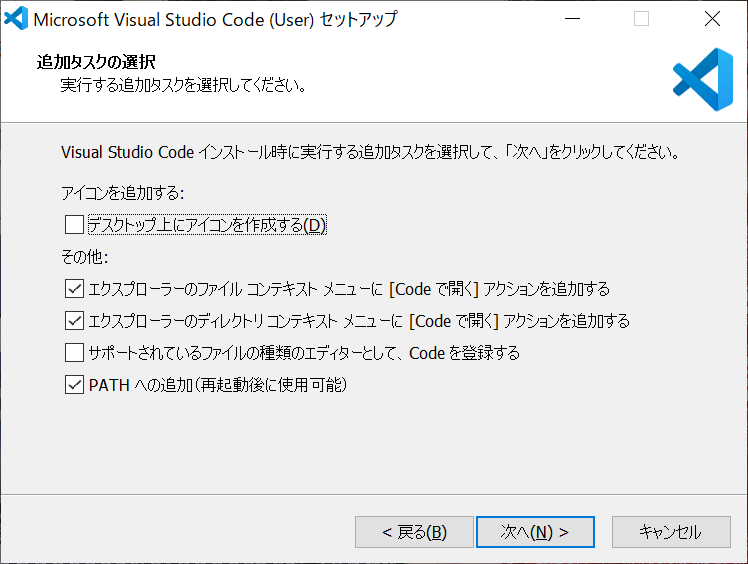
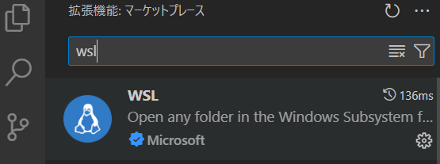
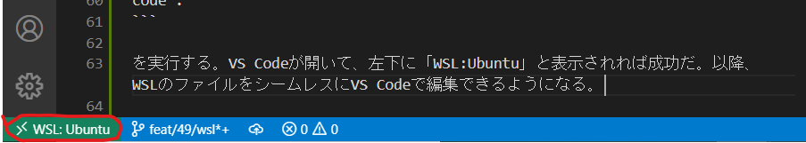
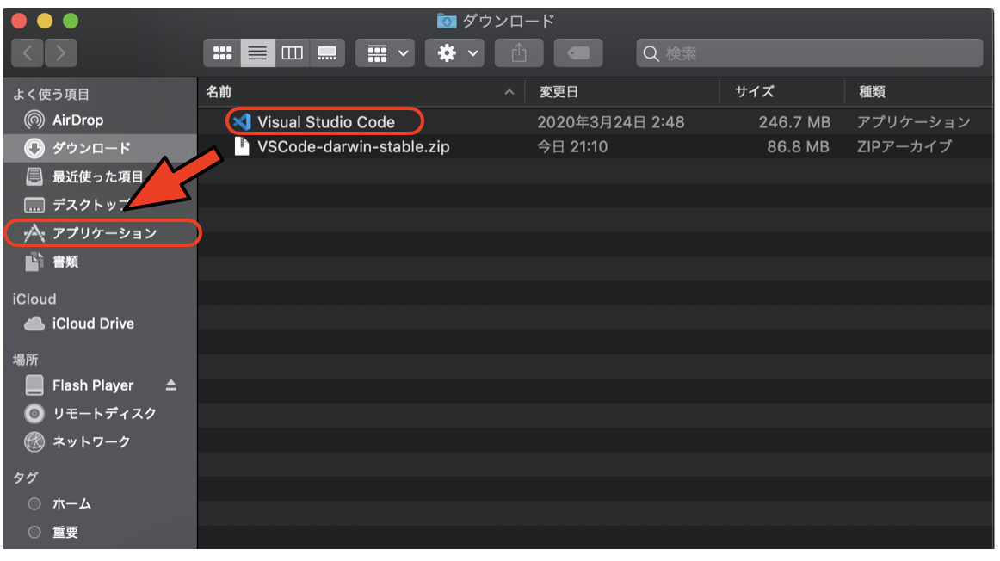
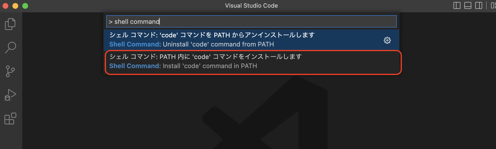
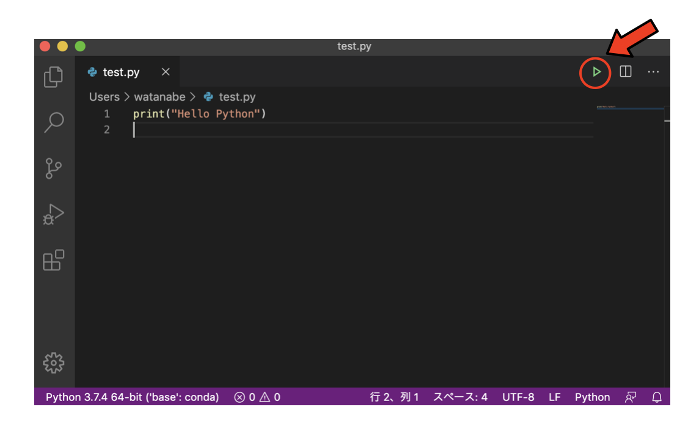

# VSCodeのインストール

Visual Studio Code、通称VSCodeは、Microsoftが中心となって開発を進めているオープンソースのエディタである。Windows/Mac/Linuxで動作するクロスプラットフォームであり、豊富なプラグインがあるためにユーザが増えている。以下ではVSCodeのインストールと、VSCodeからPythonを実行する環境まで構築する。なお、自分の好きな開発環境があるならそれを使ってよい。

## Windows編

### ダウンロードとインストール

[https://code.visualstudio.com/](https://code.visualstudio.com/)に行って、「Download for Windows Stable Build」をダウンロード、インストールする。

途中で「追加タスクの選択」が現れたら、「ファイルコンテキストメニュー」と「ディレクトリコンテキストメニュー」に「「Codeで開く」アクションを追加する」がチェックされていることを確認し、もしされていなかったらチェックしておく。



「デスクトップ上にアイコンを作成する」は、どちらでもかまわない。

インストール後、VSCodeを起動する。

### WSLとの連携

Windowsマシンでは、原則としてWindows Subsystem for Linux (WSL)上で作業を行う。VSCodeは、WindowsでもWSL上でもシームレスに利用できるが、そのためにプラグインを入れておく必要がある。

VSCodeの左のメニューからExtentionsのアイコン(ブロックのマーク)をクリックし、現れた検索窓に「WSL」と入力すると「Remote-WSL」が表示されるので、「Install」をクリックする。



これをインストールした状態で、WSLのターミナルから適当なディレクトリで

```sh
code .
```

を実行する。VS Codeが開いて、左下に「WSL:Ubuntu」と表示されれば成功だ。



以降、WSLのファイルをシームレスにVS Codeで編集できるようになる。

## Mac編

[https://code.visualstudio.com/](https://code.visualstudio.com/)に行って、「Download for Mac Stable Build」をダウンロード、インストールする。

ダウンロードフォルダに「VSCode-darwin-stable.zip」がダウンロードされるので、クリックして解凍する。解凍されてできた「Visual Studio Code」を、アプリケーションフォルダに移動する。例えば「ダウンロード」を「Finderで開く」を選び、「Visual Studio Code」を「アプリケーション」にドラッグする。



VSCodeを起動する。「アプリケーション」から「Visual Studio Code」を起動する。今後よく使うので、Dockに追加しておこう。

## 設定(Windows/Mac共通)

### シェルコマンド`code`のインストール

ファイルを開く時、メニューから探しても良いが、ターミナルから

```sh
code filename
```

として開けるようにしておくと便利だ。この機能を使うにはコマンドパレット(Shift+Command+P)を開いて「shell command」と入力すると出てくる「Shell Command: Install 'code' command in PATH」を実行すれば良い。



VSCodeではファイルではなくディレクトリを開くことが多い。カレントディレクトリをVSCodeで開くには

```sh
code .
```

とする。よく使うので覚えておこう。このとき、最初に以下のような「このディレクトリを信用するか？」という確認ダイアログが出ることがある。


自分で作成し、管理しているディレクトリであれば問題ないので、「開く」を選んでよい。

### Python環境のセットアップ

適当なディレクトリで

```sh
code test.py
```

を実行せよ。新規ファイルとして`test.py`が開かれるはずだ。すると「Pythonにおすすめの拡張機能があるがインストールするか？」と聞かれるので、インストールする。聞かれなかった場合は、VSCodeの左のメニューからExtentionsのアイコン(ブロックのマーク)をクリックし、現れた検索窓に「python」と入力、現れた「Python extension for Visual Studio Code」の「install」ボタンを押して、インストールする。「再読み込みが必要です」というボタンに変わったら、クリックして再読み込みをする。

この時、先にPython環境が正しくインストールされていれば、エディタの右下に「Python」といった表示が現れているはずだ。

Pythonの実行環境が選ばれた状態で

```py
print("Hello Python")
```

と入力し、右上にある三角のマーク(ターミナルでPythonを実行)をクリックせよ。



下にウィンドウが開いて実行結果(`Hello Python`)が表示されるはずだ。これでVSCodeからPythonを実行する環境が整った。
